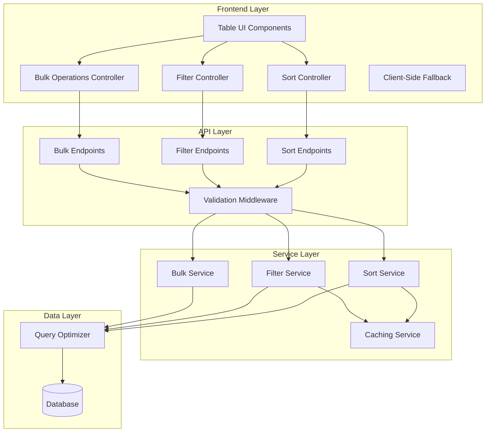

# Design Document: Enhanced Table Sorting and Filtering

## Overview

This design enhances the Pet Clinic application's table functionality by implementing server-side global sorting, status-based filtering for visits, and bulk delete operations across all pages. The solution maintains backward compatibility with existing client-side sorting while providing scalable server-side operations for large datasets.

The architecture follows a layered approach with clear separation between frontend presentation, API communication, and backend data processing. The design emphasizes reusability to facilitate future extension to other tables (owners, pets, veterinarians).

## Architecture

### High-Level Architecture



### Component Interaction Flow

1. **Sort Request Flow**: User clicks column header → Sort Controller captures event → API call to Sort Endpoint → Sort Service processes request → Database query with ORDER BY → Results returned with pagination metadata
2. **Filter Request Flow**: User selects status filter → Filter Controller updates state → API call to Filter Endpoint → Filter Service applies WHERE clause → Combined with current sort state → Results returned
3. **Bulk Delete Flow**: User selects entries → Bulk Controller maintains selection state → User confirms delete → API call to Bulk Endpoint → Bulk Service executes transaction → Table refreshed

## Components and Interfaces

### Frontend Components

#### Enhanced Table Component
```typescript
interface EnhancedTableProps {
  entityType: 'visits' | 'owners' | 'pets' | 'veterinarians';
  columns: TableColumn[];
  enableGlobalSort: boolean;
  enableFiltering: boolean;
  enableBulkOperations: boolean;
  pageSize: number;
}

interface TableColumn {
  key: string;
  label: string;
  sortable: boolean;
  filterable: boolean;
  filterType?: 'text' | 'select' | 'date';
}
```

#### Sort Controller
```typescript
interface SortController {
  currentSort: SortState;
  applySortAsync(column: string, direction: 'asc' | 'desc'): Promise<TableData>;
  clearSort(): void;
  getSortIndicator(column: string): SortIndicator;
}

interface SortState {
  column: string | null;
  direction: 'asc' | 'desc' | null;
  isGlobal: boolean;
}
```

#### Filter Controller
```typescript
interface FilterController {
  activeFilters: FilterState[];
  applyFilterAsync(filter: FilterCriteria): Promise<TableData>;
  clearFilter(filterKey: string): void;
  clearAllFilters(): void;
}

interface FilterCriteria {
  column: string;
  operator: 'equals' | 'contains' | 'in';
  value: any;
}
```

#### Bulk Operations Controller
```typescript
interface BulkController {
  selectedItems: Set<string>;
  selectAll: boolean;
  totalSelectedCount: number;
  toggleSelection(itemId: string): void;
  toggleSelectAll(): void;
  bulkDeleteAsync(): Promise<BulkOperationResult>;
  clearSelection(): void;
}
```

### Backend API Interfaces

#### Sort API Endpoints
```java
@RestController
@RequestMapping("/api/v1/{entityType}")
public class EnhancedTableController {
    
    @GetMapping
    public ResponseEntity<PagedResponse<T>> getEntities(
        @PathVariable String entityType,
        @RequestParam(defaultValue = "0") int page,
        @RequestParam(defaultValue = "10") int size,
        @RequestParam(required = false) String sortBy,
        @RequestParam(required = false) String sortDir,
        @RequestParam(required = false) Map<String, String> filters
    );
    
    @DeleteMapping("/bulk")
    public ResponseEntity<BulkOperationResult> bulkDelete(
        @RequestBody BulkDeleteRequest request
    );
}
```

#### Service Layer Interfaces
```java
public interface EnhancedTableService<T> {
    PagedResponse<T> findWithSortAndFilter(
        Pageable pageable,
        SortCriteria sortCriteria,
        List<FilterCriteria> filters
    );
    
    BulkOperationResult bulkDelete(List<Long> ids);
    
    List<String> getAvailableFilterValues(String column);
}
```

## Data Models

### Request/Response Models
```java
public class PagedResponse<T> {
    private List<T> content;
    private int page;
    private int size;
    private long totalElements;
    private int totalPages;
    private SortMetadata sortMetadata;
    private List<FilterMetadata> activeFilters;
}

public class SortMetadata {
    private String column;
    private String direction;
    private boolean isGlobal;
}

public class FilterMetadata {
    private String column;
    private String operator;
    private Object value;
    private String displayName;
}

public class BulkDeleteRequest {
    private List<Long> selectedIds;
    private boolean selectAll;
    private List<FilterCriteria> currentFilters;
}

public class BulkOperationResult {
    private int deletedCount;
    private List<String> errors;
    private boolean success;
}
```

### Database Query Models
```java
public class QueryBuilder {
    private StringBuilder query;
    private List<Object> parameters;
    
    public QueryBuilder addSort(String column, String direction);
    public QueryBuilder addFilter(String column, String operator, Object value);
    public QueryBuilder addPagination(int offset, int limit);
    public PreparedStatement build();
}
```

## Correctness Properties

*A property is a characteristic or behavior that should hold true across all valid executions of a system—essentially, a formal statement about what the system should do. Properties serve as the bridge between human-readable specifications and machine-verifiable correctness guarantees.*

Before defining the correctness properties, I need to analyze the acceptance criteria to determine which ones are testable as properties.

### Property 1: Global Sort Consistency
*For any* dataset and sortable column, when global sorting is applied, all entries across all pages should be ordered according to the specified sort criteria
**Validates: Requirements 1.1, 1.2, 1.4**

### Property 2: Sort State Persistence
*For any* sort configuration, navigating between pages should preserve the sort state and display results in the same order
**Validates: Requirements 1.3, 1.2**

### Property 3: Sort Visual Indicators
*For any* active sort state, the UI should display the correct visual indicators showing the current sort column and direction
**Validates: Requirements 1.5**

### Property 4: API Sort Parameter Validation
*For any* sort request, the backend API should accept valid sort parameters and reject invalid ones with appropriate error responses
**Validates: Requirements 2.1, 2.4**

### Property 5: Database Query Generation
*For any* valid sort request, the backend should generate database queries with correct ORDER BY clauses and return properly structured responses with pagination metadata
**Validates: Requirements 2.2, 2.3**

### Property 6: Frontend-Backend Sort Integration
*For any* sort operation initiated from the frontend, the complete round-trip should result in the UI being updated with correctly sorted results
**Validates: Requirements 2.5**

### Property 7: Status Filter Functionality
*For any* status filter value, the system should return only records matching that status and maintain the filter across pagination and sorting operations
**Validates: Requirements 3.2, 3.3**

### Property 8: Filter Clearing Behavior
*For any* active filter state, clearing the filters should restore the complete unfiltered dataset
**Validates: Requirements 3.4**

### Property 9: Combined Filter and Sort Operations
*For any* combination of filters and sort criteria, the system should correctly apply both operations and return results that satisfy both the filter conditions and sort order
**Validates: Requirements 3.5**

### Property 10: Fallback Mechanism
*For any* sort operation, when server-side sorting is unavailable, the system should gracefully degrade to client-side sorting and maintain both enhanced and legacy sorting modes
**Validates: Requirements 4.1, 4.2, 4.5**

### Property 11: Caching Consistency
*For any* repeated sort and filter request with identical parameters, subsequent requests should be served from cache while maintaining data consistency
**Validates: Requirements 5.3**

### Property 12: Concurrent Operation Safety
*For any* set of concurrent sorting and filtering operations, the system should handle them without data corruption or inconsistent states
**Validates: Requirements 5.5**

### Property 13: Selection State Management
*For any* set of selected entries across multiple pages, the selection state should be maintained during navigation and accurately reflect the total count of selected items
**Validates: Requirements 6.1, 6.2, 6.3**

### Property 14: Bulk Delete Confirmation
*For any* bulk delete operation, the system should display accurate confirmation information showing the correct count of entries to be deleted
**Validates: Requirements 6.4**

### Property 15: Bulk Delete Execution and Refresh
*For any* bulk delete operation, the server-side execution should complete successfully and the table view should refresh with updated pagination reflecting the deleted entries
**Validates: Requirements 6.5, 6.6**

## Error Handling

### Client-Side Error Handling
- **Network Failures**: Implement retry logic with exponential backoff for sort and filter requests
- **Invalid Sort Parameters**: Validate sort parameters client-side before sending to prevent unnecessary API calls
- **Selection State Corruption**: Implement recovery mechanisms to restore selection state from server if local state becomes inconsistent
- **Pagination Errors**: Handle cases where requested page no longer exists after bulk operations

### Server-Side Error Handling
- **Invalid Column Names**: Return 400 Bad Request with specific error message for invalid sort columns
- **Database Connection Failures**: Return 503 Service Unavailable and trigger client-side fallback
- **Bulk Operation Failures**: Implement transaction rollback for partial failures in bulk delete operations
- **Concurrent Modification**: Handle optimistic locking conflicts during bulk operations

### Graceful Degradation
- **Server-Side Unavailable**: Automatically fall back to client-side sorting with user notification
- **Partial Feature Failure**: Disable affected features (e.g., bulk operations) while maintaining core sorting functionality
- **Performance Degradation**: Implement circuit breaker pattern to prevent cascade failures

## Testing Strategy

### Dual Testing Approach
The testing strategy employs both unit testing and property-based testing to ensure comprehensive coverage:

- **Unit tests**: Verify specific examples, edge cases, and error conditions
- **Property tests**: Verify universal properties across all inputs
- Both approaches are complementary and necessary for comprehensive coverage

### Unit Testing Focus Areas
Unit tests should concentrate on:
- Specific examples that demonstrate correct behavior (e.g., sorting a known dataset)
- Integration points between frontend and backend components
- Edge cases such as empty datasets, single-item datasets, and boundary conditions
- Error conditions like network failures and invalid parameters
- Fallback mechanism triggers and recovery

### Property-Based Testing Configuration
- **Testing Library**: Use appropriate property-based testing library for the target language (e.g., QuickCheck for Java, fast-check for TypeScript)
- **Minimum 100 iterations** per property test due to randomization
- Each property test must reference its design document property using the tag format:
  **Feature: enhanced-table-sorting-and-filtering, Property {number}: {property_text}**
- Each correctness property must be implemented by a single property-based test

### Property Test Implementation Requirements
- Generate random datasets with varying sizes (1-1000 records)
- Generate random sort criteria (column names, directions)
- Generate random filter combinations
- Generate random selection states for bulk operations
- Verify properties hold across all generated test cases
- Include edge cases in generators (empty datasets, null values, special characters)

### Integration Testing
- Test complete user workflows from UI interaction to database updates
- Verify cross-browser compatibility for client-side fallback mechanisms
- Test performance under load with large datasets
- Validate concurrent user scenarios

### Performance Testing
- Measure sort operation response times for datasets up to 10,000 records
- Verify caching effectiveness through repeated request timing
- Test bulk operation performance with varying selection sizes
- Monitor memory usage during large dataset operations