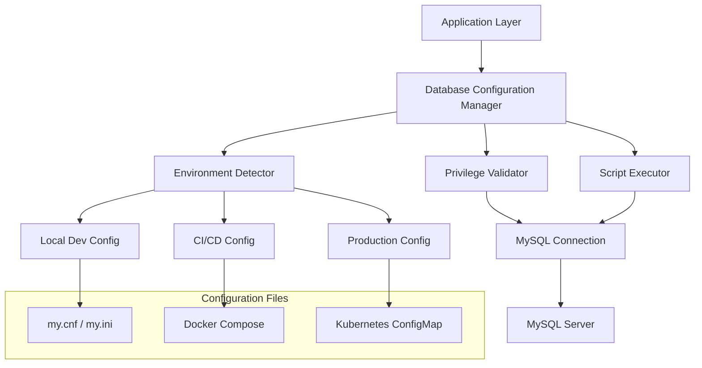

# Design Document: MySQL Privilege Configuration

## Overview

This design addresses MySQL SUPER privilege issues in CI/CD pipelines by implementing a comprehensive configuration management system. The solution provides environment-specific approaches to handle the ERROR 1419 that occurs when binary logging is enabled and database users lack SUPER privileges for creating functions, procedures, or triggers.

The design focuses on three key strategies:
1. **Configuration-based approach**: Using `log_bin_trust_function_creators` system variable
2. **Environment detection**: Automatic configuration based on deployment context
3. **Script compatibility**: Ensuring database scripts work across different privilege levels

## Architecture

The solution follows a layered architecture with clear separation of concerns:



The architecture ensures that:
- Configuration is environment-aware and automatically applied
- Privilege validation occurs before script execution
- Multiple configuration methods are supported (file-based, runtime, container-based)
- Security implications are clearly documented and enforced

## Components and Interfaces

### 1. Database Configuration Manager

**Purpose**: Central component that orchestrates MySQL privilege configuration across different environments.

**Interface**:
```typescript
interface DatabaseConfigManager {
  detectEnvironment(): Environment
  applyConfiguration(env: Environment): ConfigurationResult
  validatePrivileges(): PrivilegeStatus
  executeScript(script: string): ExecutionResult
}

enum Environment {
  LOCAL_DEVELOPMENT = "local",
  CI_CD = "ci",
  PRODUCTION = "production"
}

interface ConfigurationResult {
  success: boolean
  appliedSettings: Map<string, any>
  warnings: string[]
  errors: string[]
}
```

**Responsibilities**:
- Detect current deployment environment
- Apply appropriate MySQL configuration
- Coordinate with other components
- Provide unified error handling and logging

### 2. Environment Detector

**Purpose**: Identifies the current deployment environment to determine appropriate configuration strategy.

**Interface**:
```typescript
interface EnvironmentDetector {
  detectEnvironment(): Environment
  getEnvironmentVariables(): Map<string, string>
  isContainerized(): boolean
  isCIEnvironment(): boolean
}
```

**Detection Logic**:
- **CI/CD**: Presence of CI environment variables (CI=true, GITHUB_ACTIONS, JENKINS_URL, etc.)
- **Production**: Specific environment markers or explicit configuration
- **Local Development**: Default fallback when other environments not detected

### 3. Privilege Validator

**Purpose**: Validates MySQL user privileges and system configuration before executing database operations.

**Interface**:
```typescript
interface PrivilegeValidator {
  checkSuperPrivilege(): boolean
  checkCreateRoutinePrivilege(): boolean
  checkBinaryLoggingStatus(): boolean
  checkTrustFunctionCreators(): boolean
  generatePrivilegeReport(): PrivilegeReport
}

interface PrivilegeReport {
  hasSuperPrivilege: boolean
  hasCreateRoutine: boolean
  binaryLoggingEnabled: boolean
  trustFunctionCreatorsEnabled: boolean
  recommendedActions: string[]
}
```

### 4. Script Executor

**Purpose**: Executes database scripts with appropriate error handling and privilege management.

**Interface**:
```typescript
interface ScriptExecutor {
  executeScript(script: string, options: ExecutionOptions): ExecutionResult
  validateScript(script: string): ValidationResult
  prepareScript(script: string, env: Environment): string
}

interface ExecutionOptions {
  environment: Environment
  retryOnPrivilegeError: boolean
  applyDefinerWorkarounds: boolean
}
```

## Data Models

### Configuration Schema

```typescript
interface MySQLConfiguration {
  // Core privilege settings
  logBinTrustFunctionCreators: boolean
  binaryLogging: boolean
  
  // Environment-specific settings
  environment: Environment
  securityLevel: SecurityLevel
  
  // Connection settings
  host: string
  port: number
  database: string
  username: string
  
  // Script execution settings
  retryAttempts: number
  timeoutSeconds: number
  
  // Security constraints
  allowedDefinerUsers: string[]
  restrictedOperations: string[]
}

enum SecurityLevel {
  PERMISSIVE = "permissive",    // Local development
  BALANCED = "balanced",        // CI/CD
  RESTRICTIVE = "restrictive"   // Production
}
```

### Environment Configuration Profiles

```typescript
interface EnvironmentProfile {
  name: Environment
  mysqlConfig: {
    logBinTrustFunctionCreators: boolean
    binaryLogging: boolean
    additionalSettings: Map<string, any>
  }
  securityConstraints: {
    allowSuperPrivilege: boolean
    requireDefinerValidation: boolean
    allowDynamicSQL: boolean
  }
  scriptModifications: {
    addDefinerClauses: boolean
    wrapInTransactions: boolean
    addErrorHandling: boolean
  }
}
```

## Correctness Properties

*A property is a characteristic or behavior that should hold true across all valid executions of a system-essentially, a formal statement about what the system should do. Properties serve as the bridge between human-readable specifications and machine-verifiable correctness guarantees.*

Based on the prework analysis, the following properties validate the system's correctness:

**Property 1: Binary logging configuration consistency**
*For any* MySQL server configuration with binary logging enabled, applying our configuration logic should result in `log_bin_trust_function_creators` being set to ON
**Validates: Requirements 1.1**

**Property 2: Schema creation without SUPER privileges**
*For any* valid database schema definition, the schema should be successfully created without requiring SUPER privileges when our configuration is applied
**Validates: Requirements 1.2**

**Property 3: Binary logging functionality preservation**
*For any* MySQL server configuration, applying our privilege configuration should preserve all existing binary logging functionality for replication and recovery
**Validates: Requirements 1.3**

**Property 4: Environment-appropriate configuration**
*For any* detected environment (local, CI/CD, production), the applied configuration should match the security level appropriate for that environment, with production being most restrictive and local development being most permissive
**Validates: Requirements 1.4, 2.1, 2.2, 2.3**

**Property 5: Environment detection consistency**
*For any* set of environment conditions, switching between different environment markers should result in consistent environment detection and appropriate configuration application
**Validates: Requirements 2.4**

**Property 6: Database object creation compatibility**
*For any* database script containing functions, procedures, or triggers, the objects should be created successfully with appropriate DEFINER settings and security context regardless of SUPER privilege availability
**Validates: Requirements 3.1, 3.2, 3.3**

**Property 7: Configuration validation round-trip**
*For any* configuration change applied to MySQL, the validation system should correctly verify that the changes were successfully applied and privileges are available
**Validates: Requirements 5.1, 5.2**

**Property 8: Comprehensive error handling**
*For any* privilege-related error condition, the system should provide specific error messages with resolution steps and appropriate logging for troubleshooting
**Validates: Requirements 3.4, 5.3, 5.4**

<function_calls>
<invoke name="prework">
<parameter name="featureName">mysql-privilege-configuration

## Error Handling

The system implements comprehensive error handling for privilege-related issues:

### Error Categories

1. **Privilege Errors (ERROR 1419)**
   - **Detection**: Monitor for SUPER privilege errors during function/procedure creation
   - **Resolution**: Apply `log_bin_trust_function_creators = 1` configuration
   - **Fallback**: Provide manual privilege grant instructions

2. **Configuration Errors**
   - **Detection**: Validate MySQL system variables after configuration changes
   - **Resolution**: Retry configuration with alternative methods
   - **Fallback**: Provide environment-specific troubleshooting steps

3. **Environment Detection Errors**
   - **Detection**: Unable to determine deployment environment
   - **Resolution**: Use safe default configuration (CI/CD profile)
   - **Fallback**: Allow manual environment specification

4. **Script Execution Errors**
   - **Detection**: SQL syntax or privilege errors during script execution
   - **Resolution**: Apply DEFINER workarounds and retry
   - **Fallback**: Provide detailed error analysis and resolution steps

### Error Response Strategy

```typescript
interface ErrorHandler {
  handlePrivilegeError(error: MySQLError): ErrorResolution
  handleConfigurationError(error: ConfigError): ErrorResolution
  generateResolutionSteps(error: Error): string[]
}

interface ErrorResolution {
  canRetry: boolean
  retryStrategy: RetryStrategy
  userInstructions: string[]
  logLevel: LogLevel
}
```

### Security Considerations

**Content was rephrased for compliance with licensing restrictions**

The `log_bin_trust_function_creators` setting has important security implications:

- **Risk**: Allows creation of non-deterministic functions that may cause replication inconsistencies
- **Mitigation**: Only enable in controlled environments with trusted code
- **Best Practice**: Use restrictive DEFINER settings and validate function determinism

**Environment-Specific Security**:
- **Production**: Minimal privilege grants, strict DEFINER validation
- **CI/CD**: Automated but controlled privilege management
- **Development**: Permissive settings for development efficiency

## Testing Strategy

The testing approach combines unit tests for specific scenarios with property-based tests for comprehensive validation:

### Unit Testing Focus
- **Specific Examples**: Test known privilege error scenarios (ERROR 1419)
- **Edge Cases**: Test with various MySQL versions and configurations
- **Integration Points**: Test interaction between configuration manager and MySQL server
- **Error Conditions**: Test specific error messages and resolution steps

### Property-Based Testing Focus
- **Universal Properties**: Validate configuration behavior across all environments
- **Comprehensive Input Coverage**: Test with randomized MySQL configurations and scripts
- **Environment Variations**: Test environment detection across different deployment scenarios
- **Configuration Consistency**: Verify configuration round-trip properties

### Property Test Configuration
- **Testing Library**: Use appropriate property-based testing library for chosen implementation language
- **Minimum Iterations**: Configure each property test to run minimum 100 iterations
- **Test Tagging**: Each property test must reference its design document property
- **Tag Format**: **Feature: mysql-privilege-configuration, Property {number}: {property_text}**

### Test Environment Setup
- **MySQL Versions**: Test against MySQL 5.7, 8.0, and 8.4
- **Container Testing**: Use Docker containers for isolated MySQL instances
- **Privilege Simulation**: Create test users with various privilege levels
- **Environment Simulation**: Mock different deployment environments (CI variables, etc.)

The dual testing approach ensures both concrete bug detection through unit tests and general correctness verification through property-based testing, providing comprehensive coverage of the MySQL privilege configuration system.