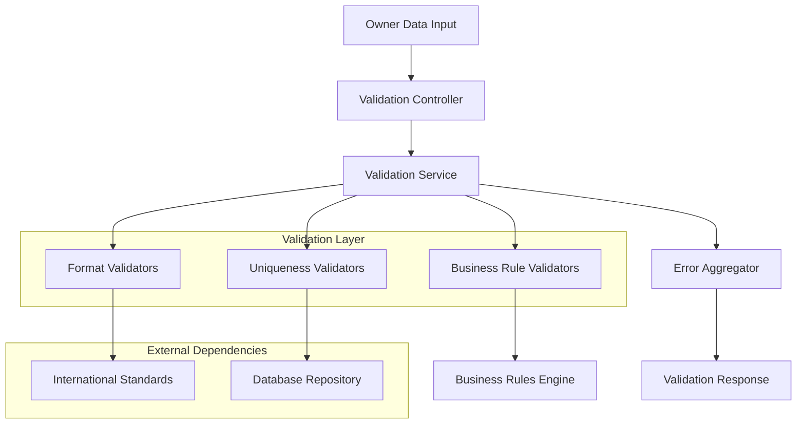

# Design Document: Owner Data Validation

## Overview

The Owner Data Validation system provides comprehensive validation of owner information with international format validation and system-wide uniqueness checks for the pet clinic application. The system leverages industry-standard validation libraries and patterns to ensure data integrity while providing detailed, actionable error feedback to users.

The design follows a layered validation approach:
1. **Format Validation**: Validates data against international standards (e.g., E.164 for mobile numbers)
2. **Business Rule Validation**: Applies clinic-specific constraints and business logic
3. **Uniqueness Validation**: Ensures system-wide uniqueness for critical fields
4. **Error Aggregation**: Collects and formats validation errors for user feedback

## Architecture

The validation system is built using a multi-layered architecture that separates concerns and provides flexibility for future extensions:



The architecture follows the Spring Boot framework patterns with JSR-303 Bean Validation integration, providing:
- **Separation of Concerns**: Each validator type handles specific validation logic
- **Extensibility**: New validators can be added without modifying existing code
- **Testability**: Each component can be unit tested independently
- **Performance**: Validation can be parallelized and cached where appropriate

## Components and Interfaces

### Core Components

#### ValidationController
- **Purpose**: REST endpoint for owner data validation
- **Responsibilities**: 
  - Receive validation requests
  - Coordinate validation process
  - Return formatted validation responses
- **Key Methods**:
  - `validateOwner(OwnerValidationRequest request): ValidationResponse`
  - `validateOwnerUpdate(Long ownerId, OwnerValidationRequest request): ValidationResponse`

#### OwnerValidationService
- **Purpose**: Orchestrates the validation process
- **Responsibilities**:
  - Coordinate multiple validation types
  - Aggregate validation results
  - Handle validation exceptions
- **Key Methods**:
  - `validateNewOwner(OwnerData ownerData): ValidationResult`
  - `validateOwnerUpdate(Long ownerId, OwnerData ownerData): ValidationResult`

#### FormatValidatorService
- **Purpose**: Validates data against international format standards
- **Responsibilities**:
  - Mobile number format validation using E.164 standard
  - Email format validation
  - Name format validation
- **Dependencies**: Google libphonenumber library for mobile validation
- **Key Methods**:
  - `validateMobileNumber(String mobileNumber): FormatValidationResult`
  - `validateEmail(String email): FormatValidationResult`

#### UniquenessValidatorService
- **Purpose**: Ensures system-wide uniqueness for critical fields
- **Responsibilities**:
  - Check mobile number uniqueness
  - Handle update scenarios (allow same owner to keep their number)
  - Provide efficient database queries
- **Key Methods**:
  - `validateMobileNumberUniqueness(String mobileNumber, Long excludeOwnerId): UniquenessValidationResult`

#### ValidationErrorAggregator
- **Purpose**: Collects and formats validation errors
- **Responsibilities**:
  - Aggregate errors from multiple validators
  - Format error messages with field-specific details
  - Provide corrective guidance
- **Key Methods**:
  - `aggregateErrors(List<ValidationError> errors): ValidationResponse`
  - `formatFieldError(String fieldName, ValidationError error): FieldErrorResponse`

### Data Transfer Objects

#### OwnerValidationRequest
```java
public class OwnerValidationRequest {
    private String firstName;
    private String lastName;
    private String email;
    private String mobileNumber;
    private String address;
    // Additional owner fields
}
```

#### ValidationResponse
```java
public class ValidationResponse {
    private boolean valid;
    private List<FieldError> fieldErrors;
    private String overallMessage;
}
```

#### FieldError
```java
public class FieldError {
    private String fieldName;
    private String errorCode;
    private String errorMessage;
    private String suggestedAction;
    private Object rejectedValue;
}
```

## Data Models

### Owner Entity
The existing Owner entity will be enhanced with validation annotations:

```java
@Entity
@Table(name = "owners")
public class Owner {
    @Id
    @GeneratedValue(strategy = GenerationType.IDENTITY)
    private Long id;
    
    @NotBlank(message = "First name is required")
    @Size(max = 50, message = "First name must not exceed 50 characters")
    private String firstName;
    
    @NotBlank(message = "Last name is required")
    @Size(max = 50, message = "Last name must not exceed 50 characters")
    private String lastName;
    
    @Email(message = "Email must be valid")
    @Size(max = 100, message = "Email must not exceed 100 characters")
    private String email;
    
    @ValidMobileNumber(message = "Mobile number must be in valid international format")
    @UniqueMobileNumber(message = "Mobile number already exists in the system")
    private String mobileNumber;
    
    @Size(max = 200, message = "Address must not exceed 200 characters")
    private String address;
    
    // Constructors, getters, setters
}
```

### Validation Result Models

#### ValidationError
```java
public class ValidationError {
    private String fieldName;
    private ErrorType errorType;
    private String message;
    private Object rejectedValue;
    private String correctionGuidance;
}
```

#### ErrorType Enumeration
```java
public enum ErrorType {
    FORMAT_INVALID,
    UNIQUENESS_VIOLATION,
    REQUIRED_FIELD_MISSING,
    LENGTH_EXCEEDED,
    BUSINESS_RULE_VIOLATION
}
```

## Correctness Properties

*A property is a characteristic or behavior that should hold true across all valid executions of a system-essentially, a formal statement about what the system should do. Properties serve as the bridge between human-readable specifications and machine-verifiable correctness guarantees.*

### Property 1: International Format Validation
*For any* owner data entry with field values, the validation system should accept all fields that conform to international format standards (E.164 for mobile numbers, RFC 5322 for emails) and reject fields that do not conform to these standards.
**Validates: Requirements 1.1, 2.1, 2.5**

### Property 2: Valid Data Acceptance and Invalid Data Rejection
*For any* owner data entry, if all validation rules pass, the system should accept and store the data; if any validation rules fail, the system should reject the data and prevent storage.
**Validates: Requirements 1.2, 1.3, 4.1**

### Property 3: Comprehensive Error Reporting
*For any* owner data entry that fails validation, the system should report all validation errors simultaneously rather than stopping at the first error.
**Validates: Requirements 1.5**

### Property 4: Mobile Number Uniqueness Validation
*For any* mobile number provided in an owner entry, the system should reject the entry if the mobile number already exists for a different owner, but allow the same mobile number when updating the existing owner who already has that number.
**Validates: Requirements 2.2, 2.3, 2.4**

### Property 5: Field-Specific Error Identification
*For any* validation error, the error response should identify the specific field that failed validation and include the field name in the error information.
**Validates: Requirements 3.1**

### Property 6: Structured Error Messages
*For any* validation error, the error message should include the field name, error type, descriptive explanation, and corrective guidance as structured information.
**Validates: Requirements 3.2, 3.4**

### Property 7: Individual Field Error Reporting
*For any* owner data entry with multiple field validation failures, each field error should be reported as a separate, distinct error entry in the response.
**Validates: Requirements 3.3**

### Property 8: Uniqueness Error Specificity
*For any* uniqueness constraint violation, the error message should specify which field value already exists in the system.
**Validates: Requirements 3.5**

### Property 9: Complete Record Validation on Updates
*For any* owner update operation, the validation system should validate the entire updated record against all current validation rules, not just the changed fields.
**Validates: Requirements 4.4**

### Property 10: Corrective Guidance in Error Messages
*For any* validation error, the error response should include specific corrective actions or guidance to help the user resolve the validation failure.
**Validates: Requirements 5.2, 5.4, 5.5**

## Error Handling

The validation system implements comprehensive error handling with the following strategies:

### Error Categories
1. **Format Errors**: Invalid data formats (mobile numbers, emails, etc.)
2. **Uniqueness Errors**: Duplicate values for unique fields
3. **Business Rule Errors**: Violations of clinic-specific business rules
4. **System Errors**: Technical failures during validation process

### Error Response Structure
All validation errors follow a consistent structure:
```json
{
  "valid": false,
  "fieldErrors": [
    {
      "fieldName": "mobileNumber",
      "errorCode": "UNIQUENESS_VIOLATION",
      "errorMessage": "Mobile number +1-555-123-4567 already exists in the system",
      "suggestedAction": "Please use a different mobile number or contact support if this is your number",
      "rejectedValue": "+1-555-123-4567"
    }
  ],
  "overallMessage": "Owner validation failed due to 1 field error"
}
```

### Error Recovery Strategies
- **Graceful Degradation**: System continues processing other fields even when some fail
- **Detailed Feedback**: Specific error messages help users correct issues quickly
- **Retry Mechanisms**: Users can immediately retry with corrected data
- **Audit Trail**: All validation attempts are logged for troubleshooting

### Exception Handling
- **ValidationException**: Thrown for business rule violations
- **FormatValidationException**: Thrown for format-related errors
- **UniquenessViolationException**: Thrown for uniqueness constraint violations
- **SystemValidationException**: Thrown for technical validation failures

## Testing Strategy

The validation system employs a dual testing approach combining unit tests for specific scenarios and property-based tests for comprehensive coverage.

### Unit Testing Approach
Unit tests focus on:
- **Specific Examples**: Test known valid and invalid data samples
- **Edge Cases**: Boundary conditions, empty values, maximum lengths
- **Error Conditions**: Specific error scenarios and exception handling
- **Integration Points**: Interaction between validation components

Example unit tests:
- Valid E.164 mobile numbers from different countries
- Invalid mobile number formats
- Duplicate mobile number scenarios
- Error message formatting and content

### Property-Based Testing Approach
Property-based tests validate universal properties across randomly generated inputs:
- **Minimum 100 iterations** per property test to ensure comprehensive coverage
- **Random data generation** for owner fields with various valid/invalid combinations
- **Comprehensive input space coverage** through randomization

Each property test is tagged with: **Feature: owner-data-validation, Property {number}: {property_text}**

### Testing Configuration
- **Framework**: JUnit 5 with jqwik for property-based testing
- **Mock Dependencies**: Mockito for database and external service mocking
- **Test Data**: TestContainers for integration testing with real database
- **Coverage Target**: 90% code coverage with focus on validation logic paths

### Integration Testing
- **Database Integration**: Test uniqueness validation with real database queries
- **External Library Integration**: Test libphonenumber integration for mobile validation
- **End-to-End Scenarios**: Complete validation workflows from API to database

The testing strategy ensures both specific correctness (unit tests) and general correctness (property tests) while maintaining fast feedback cycles for developers.