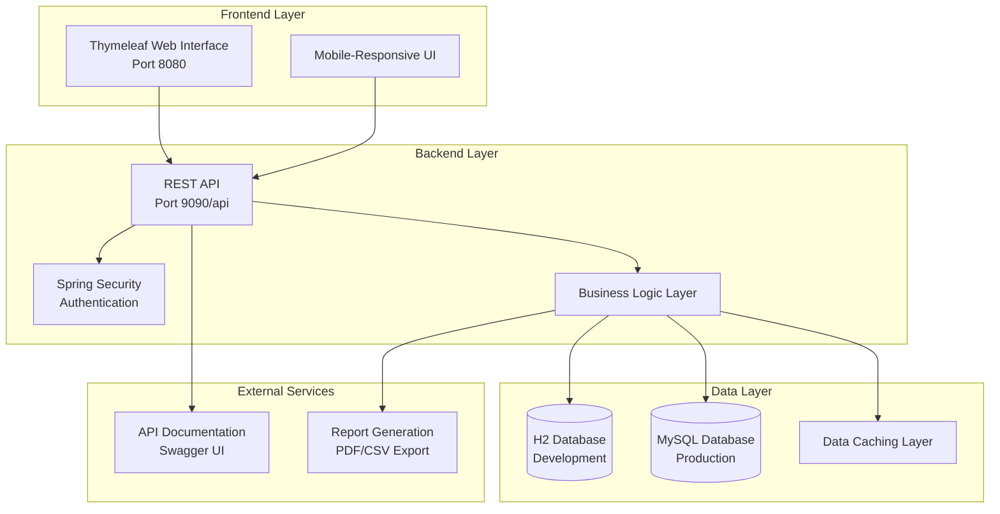
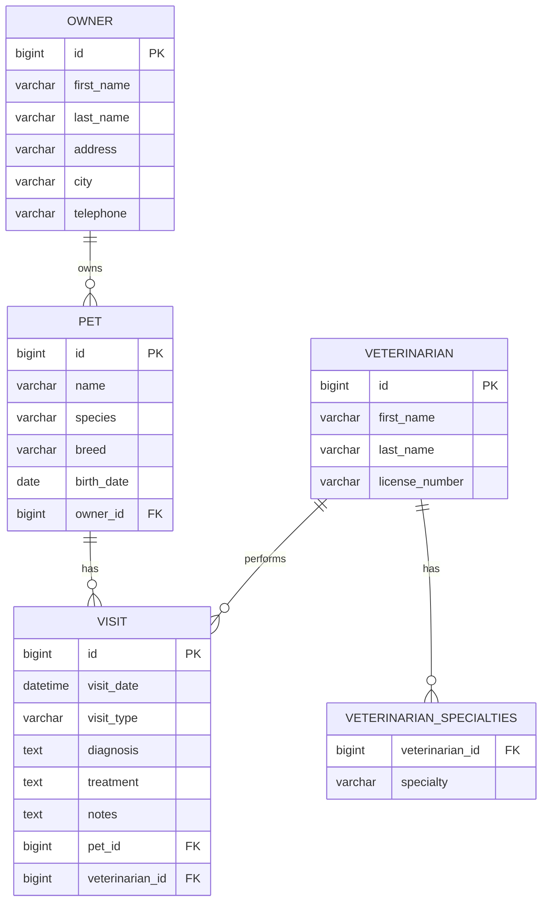

# Design Document: Pet Clinic Application Development

## Overview

The Pet Clinic Management System is a comprehensive veterinary practice management application built on Java Spring Boot with a multi-module architecture. The system extends the existing Owner management foundation to provide complete clinic operations including pet management, visit scheduling, veterinarian management, and reporting capabilities.

The design leverages the existing Spring Boot infrastructure with H2 for development and MySQL for production, maintaining the current authentication system while adding role-based access control. The architecture follows RESTful API principles with a Thymeleaf-based frontend, ensuring separation of concerns and maintainability.

## Architecture

### System Architecture



### Module Structure

The application maintains the existing two-module structure:

- **pet-clinic-backend**: REST API services, data persistence, business logic
- **pet-clinic-frontend**: Thymeleaf web interface, controllers, UI components

### Technology Stack

- **Backend**: Java 11+, Spring Boot, Spring Data JPA, Spring Security
- **Frontend**: Thymeleaf, Bootstrap, JavaScript, HTML5/CSS3
- **Database**: H2 (development), MySQL (production)
- **Build**: Maven
- **Documentation**: OpenAPI/Swagger
- **Testing**: JUnit 5, Mockito, TestContainers

## Components and Interfaces

### Core Domain Entities

#### Pet Entity
```java
@Entity
public class Pet {
    @Id @GeneratedValue
    private Long id;
    
    @NotBlank
    private String name;
    
    @NotBlank
    private String species;
    
    private String breed;
    
    @Past
    private LocalDate birthDate;
    
    @ManyToOne(fetch = FetchType.LAZY)
    @JoinColumn(name = "owner_id")
    private Owner owner;
    
    @OneToMany(mappedBy = "pet", cascade = CascadeType.ALL)
    private List<Visit> visits = new ArrayList<>();
}
```

#### Visit Entity
```java
@Entity
public class Visit {
    @Id @GeneratedValue
    private Long id;
    
    @NotNull
    private LocalDateTime visitDate;
    
    @NotBlank
    private String visitType;
    
    private String diagnosis;
    private String treatment;
    private String notes;
    
    @ManyToOne(fetch = FetchType.LAZY)
    @JoinColumn(name = "pet_id")
    private Pet pet;
    
    @ManyToOne(fetch = FetchType.LAZY)
    @JoinColumn(name = "veterinarian_id")
    private Veterinarian veterinarian;
}
```

#### Veterinarian Entity
```java
@Entity
public class Veterinarian {
    @Id @GeneratedValue
    private Long id;
    
    @NotBlank
    private String firstName;
    
    @NotBlank
    private String lastName;
    
    @NotBlank
    private String licenseNumber;
    
    @ElementCollection
    @Enumerated(EnumType.STRING)
    private Set<Specialty> specialties = new HashSet<>();
    
    @OneToMany(mappedBy = "veterinarian")
    private List<Visit> visits = new ArrayList<>();
}
```

### Service Layer Interfaces

#### Pet Management Service
```java
@Service
public interface PetService {
    Pet createPet(Pet pet);
    Pet updatePet(Long id, Pet pet);
    Pet findById(Long id);
    List<Pet> findByOwner(Long ownerId);
    List<Pet> searchPets(String searchTerm);
    void deletePet(Long id);
    boolean canDeletePet(Long id);
}
```

#### Visit Management Service
```java
@Service
public interface VisitService {
    Visit scheduleVisit(Visit visit);
    Visit completeVisit(Long id, String diagnosis, String treatment, String notes);
    List<Visit> findByPet(Long petId);
    List<Visit> findByVeterinarian(Long vetId);
    List<Visit> findByDateRange(LocalDate start, LocalDate end);
    boolean isVeterinarianAvailable(Long vetId, LocalDateTime dateTime);
}
```

#### Veterinarian Management Service
```java
@Service
public interface VeterinarianService {
    Veterinarian createVeterinarian(Veterinarian vet);
    Veterinarian updateVeterinarian(Long id, Veterinarian vet);
    List<Veterinarian> findBySpecialty(Specialty specialty);
    List<Veterinarian> findAvailable(LocalDateTime dateTime);
    boolean canDeleteVeterinarian(Long id);
}
```

### REST API Endpoints

#### Pet Management API
```
GET    /api/pets                    - List all pets with pagination
POST   /api/pets                    - Create new pet
GET    /api/pets/{id}               - Get pet by ID
PUT    /api/pets/{id}               - Update pet
DELETE /api/pets/{id}               - Delete pet
GET    /api/pets/search             - Search pets by criteria
GET    /api/owners/{id}/pets        - Get pets by owner
```

#### Visit Management API
```
GET    /api/visits                  - List visits with pagination
POST   /api/visits                  - Schedule new visit
GET    /api/visits/{id}             - Get visit details
PUT    /api/visits/{id}             - Update visit
DELETE /api/visits/{id}             - Cancel visit
GET    /api/pets/{id}/visits        - Get visits for pet
GET    /api/veterinarians/{id}/visits - Get visits for veterinarian
```

#### Veterinarian Management API
```
GET    /api/veterinarians           - List all veterinarians
POST   /api/veterinarians           - Create veterinarian
GET    /api/veterinarians/{id}      - Get veterinarian details
PUT    /api/veterinarians/{id}      - Update veterinarian
DELETE /api/veterinarians/{id}      - Delete veterinarian
GET    /api/veterinarians/available - Get available veterinarians
```

#### Reporting API
```
GET    /api/reports/visits          - Visit statistics report
GET    /api/reports/revenue         - Revenue analysis report
GET    /api/reports/dashboard       - Dashboard metrics
POST   /api/reports/export          - Export reports (PDF/CSV)
```

## Data Models

### Database Schema Design



### Data Validation Rules

- **Pet Names**: Required, 1-50 characters, alphanumeric and spaces
- **Species**: Required, from predefined list (Dog, Cat, Bird, Rabbit, etc.)
- **Birth Date**: Must be in the past, not more than 30 years ago
- **Visit Date**: Cannot be more than 1 year in the future
- **License Numbers**: Required for veterinarians, unique, alphanumeric format
- **Specialties**: Must be from predefined enum values

### Data Relationships

- **Owner-Pet**: One-to-Many (cascade delete prevented if pets have visits)
- **Pet-Visit**: One-to-Many (cascade delete for visits when pet deleted)
- **Veterinarian-Visit**: One-to-Many (cascade delete prevented)
- **Veterinarian-Specialties**: One-to-Many (embedded collection)

## Error Handling

### Exception Hierarchy

```java
public class PetClinicException extends RuntimeException {
    private final String errorCode;
    private final HttpStatus httpStatus;
}

public class EntityNotFoundException extends PetClinicException {
    // HTTP 404 - Resource not found
}

public class ValidationException extends PetClinicException {
    // HTTP 400 - Invalid input data
}

public class BusinessRuleException extends PetClinicException {
    // HTTP 422 - Business logic violation
}

public class ConflictException extends PetClinicException {
    // HTTP 409 - Resource conflict (e.g., scheduling conflict)
}
```

### Error Response Format

```json
{
    "timestamp": "2024-01-15T10:30:00Z",
    "status": 404,
    "error": "Not Found",
    "message": "Pet with ID 123 not found",
    "path": "/api/pets/123",
    "errorCode": "PET_NOT_FOUND"
}
```

### Global Exception Handler

- Centralized exception handling using `@ControllerAdvice`
- Consistent error response format across all endpoints
- Logging of all exceptions with appropriate severity levels
- Sanitized error messages to prevent information leakage

## Testing Strategy

### Dual Testing Approach

The system employs both unit testing and property-based testing for comprehensive coverage:

**Unit Tests**:
- Specific examples demonstrating correct behavior
- Edge cases and error conditions
- Integration points between components
- Mock-based testing for service layer isolation

**Property Tests**:
- Universal properties that hold for all inputs
- Comprehensive input coverage through randomization
- Minimum 100 iterations per property test
- Each test references its corresponding design property

### Testing Configuration

- **Framework**: JUnit 5 with Mockito for mocking
- **Property Testing**: QuickTheories for Java property-based testing
- **Database Testing**: TestContainers for integration tests
- **Web Testing**: MockMvc for controller testing
- **Test Data**: Factory pattern for test data generation

### Test Categories

1. **Unit Tests**: Service layer business logic, validation rules
2. **Integration Tests**: Database operations, API endpoints
3. **Property Tests**: Universal correctness properties
4. **End-to-End Tests**: Complete user workflows
5. **Performance Tests**: Load testing for concurrent users

## Correctness Properties

*A property is a characteristic or behavior that should hold true across all valid executions of a system-essentially, a formal statement about what the system should do. Properties serve as the bridge between human-readable specifications and machine-verifiable correctness guarantees.*

### Property Reflection

After analyzing all acceptance criteria, I identified several areas where properties can be consolidated to eliminate redundancy:

- Pet and Veterinarian creation/update properties can be combined into general entity management properties
- Search and filtering properties across different entities share common patterns
- Validation properties for different entity types follow similar patterns
- Referential integrity properties apply consistently across entity relationships

### Core Data Management Properties

**Property 1: Entity Creation Completeness**
*For any* valid entity data (Pet, Veterinarian, Visit), creating the entity should result in all required fields being stored and retrievable
**Validates: Requirements 1.1, 2.1, 3.1**

**Property 2: Entity Update Persistence**
*For any* existing entity and valid update data, updating the entity should result in changes being immediately persisted and retrievable
**Validates: Requirements 1.2, 2.2**

**Property 3: Referential Integrity Protection**
*For any* entity with dependent relationships (Pet with Visits, Veterinarian with Visits), deletion attempts should be prevented when dependencies exist
**Validates: Requirements 1.5, 3.5**

### Search and Filtering Properties

**Property 4: Search Result Accuracy**
*For any* search query and entity collection, returned results should contain only entities that match the search criteria across all searchable fields
**Validates: Requirements 1.3, 4.1, 4.4**

**Property 5: Filter Combination Logic**
*For any* set of filters applied to a dataset, results should match all filter criteria using logical AND operations
**Validates: Requirements 4.2, 5.5**

**Property 6: Search Result Completeness**
*For any* search query, results should include result counts and proper highlighting of matching terms where applicable
**Validates: Requirements 4.3**

### Business Logic Properties

**Property 7: Scheduling Conflict Prevention**
*For any* veterinarian and time slot, attempting to schedule overlapping appointments should be prevented
**Validates: Requirements 2.4**

**Property 8: Visit Duration Calculation**
*For any* visit type, the system should automatically calculate and assign the correct duration based on predefined visit type rules
**Validates: Requirements 2.5**

**Property 9: Specialty-Based Filtering**
*For any* visit type requiring specific specialties, only veterinarians with matching specialties should be available for selection
**Validates: Requirements 3.3**

**Property 10: Availability Tracking**
*For any* veterinarian and time period, availability should be calculated correctly based on working hours and existing appointments
**Validates: Requirements 3.4**

### Validation Properties

**Property 11: Specialty Validation**
*For any* specialty assignment to a veterinarian, the specialty must exist in the predefined specialty enumeration
**Validates: Requirements 3.2**

**Property 12: Input Validation Consistency**
*For any* form input across the system, validation should enforce consistent rules for data types, formats, and constraints
**Validates: Requirements 6.3**

### Reporting and Analytics Properties

**Property 13: Report Aggregation Accuracy**
*For any* report request with grouping criteria (date range, veterinarian, visit type), aggregated data should accurately reflect the underlying data
**Validates: Requirements 5.1, 5.4**

**Property 14: Revenue Calculation Correctness**
*For any* set of visits with associated fees, revenue calculations should accurately sum fees and display correct trends over time
**Validates: Requirements 5.2**

**Property 15: Export Format Consistency**
*For any* report data, both PDF and CSV export formats should contain identical data with appropriate formatting for each format
**Validates: Requirements 5.3**

### API and Documentation Properties

**Property 16: API Documentation Completeness**
*For any* REST endpoint, the generated OpenAPI documentation should include endpoint definition, parameters, and response schemas
**Validates: Requirements 7.1, 7.2**

**Property 17: Error Response Standardization**
*For any* API error condition, the response should follow the standardized error format with appropriate HTTP status codes
**Validates: Requirements 7.4**

**Property 18: API Versioning Consistency**
*For any* versioned API endpoint, requests should be routed to the correct version and maintain backward compatibility
**Validates: Requirements 7.5**

### Data Persistence Properties

**Property 19: Migration Execution Reliability**
*For any* system startup, database schema migrations should be applied in correct order and complete successfully
**Validates: Requirements 8.1**

**Property 20: Data Seeding Consistency**
*For any* development or test environment initialization, sample data should be created consistently and completely
**Validates: Requirements 8.3**

**Property 21: Error Logging Completeness**
*For any* data corruption or system error, appropriate error messages should be logged with sufficient detail for debugging
**Validates: Requirements 8.4**

**Property 22: Backup and Restore Integrity**
*For any* backup operation followed by restore, the restored data should be identical to the original data
**Validates: Requirements 8.5**

### Security Properties

**Property 23: Role-Based Access Control**
*For any* user with a specific role, access should be granted only to resources and operations appropriate for that role
**Validates: Requirements 9.1**

**Property 24: Audit Trail Completeness**
*For any* access to sensitive data, an audit log entry should be created with user, timestamp, and resource information
**Validates: Requirements 9.2**

**Property 25: Authentication Token Validation**
*For any* API request, invalid or expired authentication tokens should be rejected with appropriate error responses
**Validates: Requirements 9.4**

**Property 26: Data Encryption Consistency**
*For any* sensitive data, encryption should be applied consistently at rest and in transit
**Validates: Requirements 9.5**

**Property 27: Password Complexity Enforcement**
*For any* password creation or update, the password should meet all defined complexity requirements
**Validates: Requirements 9.3**

### Performance Properties

**Property 28: Pagination Implementation**
*For any* large dataset query, results should be properly paginated with correct page sizes and navigation
**Validates: Requirements 10.2**

**Property 29: Caching Effectiveness**
*For any* frequently accessed data, subsequent requests should be served from cache when data hasn't changed
**Validates: Requirements 10.3**