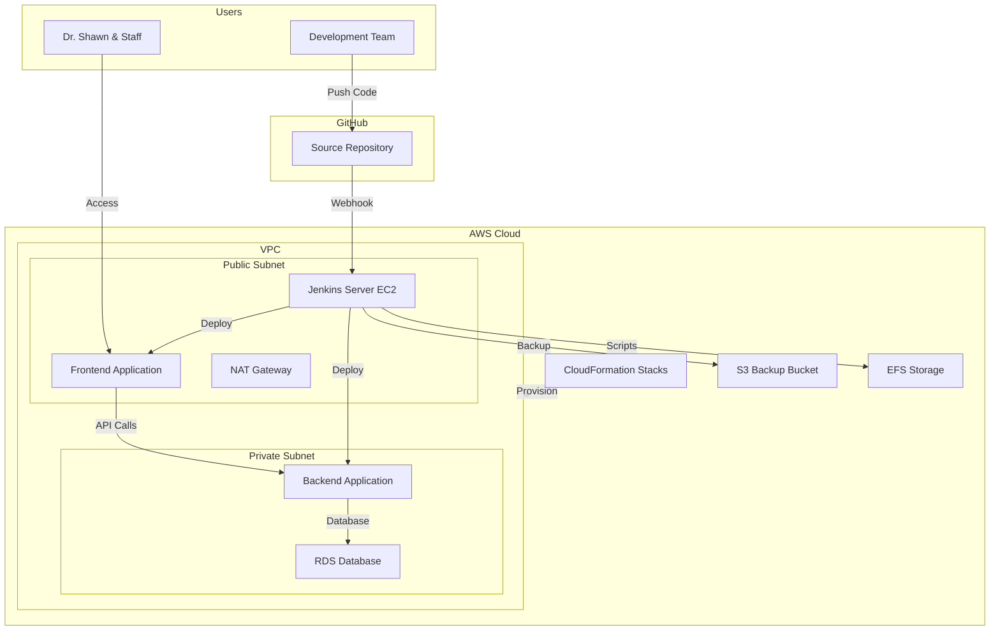

# Design Document: Pet Clinic CI/CD Pipeline

## Overview

This design document outlines the architecture for a comprehensive CI/CD pipeline using Jenkins to deploy a pet clinic management system on AWS EC2. The solution implements Infrastructure as Code using CloudFormation, secure network architecture with public/private subnets, automated backup/restore capabilities, and a complete Java-based application deployment pipeline.

The architecture follows AWS Well-Architected Framework principles, emphasizing security, reliability, performance efficiency, and cost optimization. The system enables Dr. Shawn's pet clinic to manage operations through a secure, cloud-hosted application with automated deployment capabilities.

## Architecture

### High-Level Architecture



### Network Architecture

The VPC design implements a secure three-tier architecture:

**Public Subnet (10.0.1.0/24)**:
- Jenkins Server EC2 instance
- Frontend application servers
- NAT Gateway for private subnet internet access
- Application Load Balancer (if needed)

**Private Subnet (10.0.2.0/24)**:
- Backend application servers
- RDS database instances
- Internal services without direct internet access

**Security Groups**:
- Jenkins SG: Allows HTTP/HTTPS (80, 443, 8080) from internet, SSH (22) from admin IPs
- Frontend SG: Allows HTTP/HTTPS from internet, backend communication
- Backend SG: Allows communication from frontend SG only
- Database SG: Allows MySQL/PostgreSQL from backend SG only

## Components and Interfaces

### Jenkins Server Component

**Purpose**: Central orchestration of CI/CD pipeline operations
**Location**: EC2 instance in public subnet
**Instance Type**: t3.medium (2 vCPU, 4 GB RAM) - scalable based on workload

**Key Plugins**:
- GitHub Integration Plugin
- AWS CLI Plugin
- Pipeline Plugin
- Blue Ocean Plugin
- ThinBackup Plugin
- Maven Integration Plugin

**Configuration**:
- Jenkins Home: `/var/lib/jenkins`
- Java Runtime: OpenJDK 11
- Maven: Latest stable version
- AWS CLI: Latest version with IAM role authentication

### CloudFormation Infrastructure

**Master Stack**: Orchestrates nested stacks for modular deployment

**Nested Stacks**:
1. **Network Stack**: VPC, subnets, security groups, NAT gateway
2. **Compute Stack**: EC2 instances, auto-scaling groups
3. **Database Stack**: RDS instance with Multi-AZ deployment
4. **Storage Stack**: S3 buckets, EFS file system
5. **IAM Stack**: Roles, policies, instance profiles

**Stack Parameters**:
- Environment (dev/staging/prod)
- Instance types and sizes
- Database configuration
- Backup retention policies

### Pet Clinic Application Architecture

**Frontend Component**:
- **Technology**: Java Spring Boot with Thymeleaf templates
- **Location**: Public subnet EC2 instances
- **Port**: 8080 (behind load balancer on 80/443)
- **Features**: Web interface for clinic management, responsive design

**Backend Component**:
- **Technology**: Java Spring Boot REST API
- **Location**: Private subnet EC2 instances
- **Port**: 8081 (internal communication only)
- **Features**: Business logic, data validation, API endpoints

**Database Component**:
- **Technology**: AWS RDS MySQL 8.0
- **Location**: Private subnet with Multi-AZ deployment
- **Storage**: 100GB GP2 with auto-scaling enabled
- **Backup**: Automated daily backups with 7-day retention

### EFS Integration

**Purpose**: Centralized storage for installation scripts and shared configuration
**Mount Point**: `/mnt/efs` on all EC2 instances
**Contents**:
- Java installation scripts
- Maven configuration files
- Application deployment scripts
- Environment-specific configuration templates

### Backup and Restore System

**Jenkins Backup Strategy**:
- **Automated Daily Backups**: ThinBackup plugin creates incremental backups
- **S3 Storage**: Encrypted backup files stored in dedicated S3 bucket
- **Retention Policy**: 30 daily, 12 weekly, 12 monthly backups
- **Backup Contents**: Jenkins home directory, job configurations, build history

**Restore Process**:
1. Launch new Jenkins EC2 instance from AMI
2. Install Jenkins and required plugins
3. Download latest backup from S3
4. Extract backup to Jenkins home directory
5. Restart Jenkins service
6. Verify job configurations and connectivity

## Data Models

### Pet Clinic Domain Models

```java
// Pet Entity
public class Pet {
    private Long id;
    private String name;
    private String species;
    private String breed;
    private LocalDate birthDate;
    private Owner owner;
    private List<Visit> visits;
}

// Owner Entity
public class Owner {
    private Long id;
    private String firstName;
    private String lastName;
    private String address;
    private String city;
    private String telephone;
    private String email;
    private List<Pet> pets;
}

// Visit Entity
public class Visit {
    private Long id;
    private LocalDateTime visitDate;
    private String description;
    private String diagnosis;
    private String treatment;
    private BigDecimal cost;
    private Pet pet;
    private Veterinarian veterinarian;
}

// Veterinarian Entity
public class Veterinarian {
    private Long id;
    private String firstName;
    private String lastName;
    private String specialties;
    private String licenseNumber;
    private List<Visit> visits;
}
```

### Jenkins Pipeline Configuration

```groovy
// Jenkinsfile structure
pipeline {
    agent any
    
    environment {
        AWS_REGION = 'us-east-1'
        S3_BUCKET = 'pet-clinic-artifacts'
        ECR_REPOSITORY = 'pet-clinic-app'
    }
    
    stages {
        stage('Checkout') { /* Source code checkout */ }
        stage('Build') { /* Maven build and test */ }
        stage('Package') { /* Create deployment artifacts */ }
        stage('Deploy to Staging') { /* Deploy to staging environment */ }
        stage('Integration Tests') { /* Run integration tests */ }
        stage('Deploy to Production') { /* Deploy to production */ }
        stage('Health Check') { /* Verify deployment health */ }
    }
    
    post {
        always { /* Cleanup and notifications */ }
        failure { /* Rollback procedures */ }
    }
}
```

### Infrastructure Configuration Models

**CloudFormation Template Structure**:
```yaml
# Master template parameters
Parameters:
  Environment:
    Type: String
    AllowedValues: [dev, staging, prod]
  
  InstanceType:
    Type: String
    Default: t3.medium
  
  DatabaseInstanceClass:
    Type: String
    Default: db.t3.micro

# Nested stack references
Resources:
  NetworkStack:
    Type: AWS::CloudFormation::Stack
    Properties:
      TemplateURL: !Sub '${TemplateBaseURL}/network.yaml'
      
  ComputeStack:
    Type: AWS::CloudFormation::Stack
    DependsOn: NetworkStack
    Properties:
      TemplateURL: !Sub '${TemplateBaseURL}/compute.yaml'
```

Now I need to use the prework tool to analyze the acceptance criteria before writing the Correctness Properties section:

## Correctness Properties

*A property is a characteristic or behavior that should hold true across all valid executions of a system—essentially, a formal statement about what the system should do. Properties serve as the bridge between human-readable specifications and machine-verifiable correctness guarantees.*

### Property 1: Jenkins GitHub Integration Workflow
*For any* code push to the main branch, Jenkins should automatically trigger a build, execute the pipeline, and report the final status back to GitHub
**Validates: Requirements 1.1, 1.4**

### Property 2: Pull Request Validation
*For any* pull request created in the repository, Jenkins should run validation tests and update the PR status with pass/fail results
**Validates: Requirements 1.2**

### Property 3: Source Code Retrieval Consistency
*For any* build execution, Jenkins should clone the exact source code from the repository that corresponds to the triggering commit
**Validates: Requirements 1.5**

### Property 4: Infrastructure Update Idempotency
*For any* CloudFormation stack update operation, running the same update multiple times should produce the same infrastructure state without data loss
**Validates: Requirements 2.4**

### Property 5: Network Security Enforcement
*For any* network traffic attempt, the security groups should only allow connections that match the defined security rules (frontend to backend, backend to database, etc.)
**Validates: Requirements 3.4**

### Property 6: CI/CD Pipeline Build Consistency
*For any* source code commit, the CI/CD pipeline should produce the same build artifacts when given the same input code
**Validates: Requirements 6.1**

### Property 7: Deployment Health Validation
*For any* successful deployment, the health check process should verify that all deployed components are responding correctly before marking the deployment as complete
**Validates: Requirements 6.4**

### Property 8: Automatic Rollback on Failure
*For any* deployment that fails health checks or encounters errors, the system should automatically rollback to the previous working version
**Validates: Requirements 6.5**

### Property 9: Backup Data Integrity
*For any* Jenkins backup created, restoring from that backup should recreate a Jenkins instance with identical job configurations, build history, and system settings
**Validates: Requirements 7.1, 7.2, 7.4**

### Property 10: Backup Retention Policy Compliance
*For any* backup retention policy configuration, the backup system should automatically remove backups that exceed the retention period while preserving those within the policy
**Validates: Requirements 7.5**

### Property 11: Pet Clinic Data Persistence
*For any* pet, owner, or visit record created in the system, the data should be retrievable with all original information intact after storage and retrieval operations
**Validates: Requirements 8.1, 8.2, 8.3**

### Property 12: Search and Filter Accuracy
*For any* search query or filter criteria applied to pets or owners, the results should include all records that match the criteria and exclude all records that don't match
**Validates: Requirements 8.4**

### Property 13: Authentication Enforcement
*For any* attempt to access the Pet Clinic System, the system should require valid authentication credentials before allowing access to any functionality
**Validates: Requirements 10.2**

### Property 14: Comprehensive Activity Logging
*For any* system operation (builds, deployments, application events), the corresponding log entries should be created with sufficient detail for troubleshooting and audit purposes
**Validates: Requirements 9.1, 9.2**

### Property 15: Critical Issue Notification
*For any* critical system issue or failure, the monitoring system should send notifications to administrators within the defined time threshold
**Validates: Requirements 9.5**

## Error Handling

### Infrastructure Failures
- **CloudFormation Stack Failures**: Implement rollback mechanisms for failed stack deployments
- **EC2 Instance Failures**: Use Auto Scaling Groups for automatic instance replacement
- **RDS Failures**: Multi-AZ deployment provides automatic failover
- **Network Connectivity Issues**: Health checks and retry mechanisms for transient failures

### Jenkins Pipeline Failures
- **Build Failures**: Automatic notification to development team with detailed error logs
- **Deployment Failures**: Automatic rollback to previous stable version
- **Plugin Failures**: Graceful degradation and alternative execution paths
- **Resource Exhaustion**: Monitoring and alerting for disk space, memory, and CPU usage

### Application Failures
- **Database Connection Failures**: Connection pooling with retry logic and circuit breaker patterns
- **Service Unavailability**: Health check endpoints and graceful degradation
- **Data Validation Errors**: Comprehensive input validation with user-friendly error messages
- **Authentication Failures**: Secure error handling without information disclosure

### Backup and Recovery Failures
- **Backup Creation Failures**: Multiple backup strategies (local and S3) with failure notifications
- **Restore Failures**: Validation of backup integrity before restore operations
- **S3 Access Issues**: IAM role validation and alternative backup locations
- **Data Corruption**: Checksums and integrity verification for all backup operations

## Testing Strategy

### Dual Testing Approach

The testing strategy employs both unit testing and property-based testing to ensure comprehensive coverage:

**Unit Tests**: Focus on specific examples, edge cases, and integration points
- Infrastructure deployment validation
- Jenkins plugin configuration verification
- Database connection and query testing
- Authentication and authorization scenarios
- Error condition handling

**Property-Based Tests**: Verify universal properties across all inputs using automated test generation
- Minimum 100 iterations per property test
- Each property test references its corresponding design document property
- Tag format: **Feature: pet-clinic-cicd-pipeline, Property {number}: {property_text}**

### Property-Based Testing Configuration

**Testing Framework**: 
- **Java Applications**: Use QuickCheck for Java or jqwik for property-based testing
- **Infrastructure**: Use AWS CloudFormation testing tools and custom validation scripts
- **Jenkins**: Use Jenkins Test Harness for pipeline testing

**Test Configuration**:
- Each correctness property implemented as a single property-based test
- Minimum 100 test iterations per property to ensure statistical confidence
- Randomized input generation for comprehensive coverage
- Automated test execution as part of CI/CD pipeline

**Test Categories**:
1. **Infrastructure Properties**: CloudFormation stack validation, network configuration
2. **Pipeline Properties**: Build consistency, deployment validation, rollback functionality
3. **Application Properties**: Data persistence, search functionality, authentication
4. **Integration Properties**: End-to-end workflow validation, cross-component communication

### Unit Testing Balance

Unit tests complement property-based tests by focusing on:
- **Specific Examples**: Known good and bad inputs with expected outcomes
- **Edge Cases**: Boundary conditions and error scenarios
- **Integration Points**: Component interaction validation
- **Configuration Validation**: Infrastructure and application configuration correctness

Property-based tests handle comprehensive input coverage through randomization, while unit tests provide concrete examples and validate specific scenarios that are important for system reliability.

### Continuous Testing Integration

All tests are integrated into the Jenkins CI/CD pipeline:
- **Pre-deployment**: Unit tests and property tests run before any deployment
- **Post-deployment**: Integration tests and health checks validate deployed system
- **Scheduled Testing**: Regular execution of comprehensive test suites
- **Failure Handling**: Automatic rollback and notification on test failures