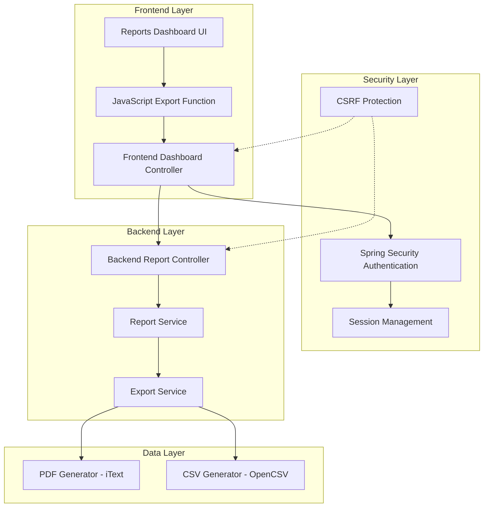

# Design Document: Report Download Fix

## Overview

The Pet Clinic application has a comprehensive report export system implemented across both frontend and backend services, but users are experiencing download failures. The system includes:

- **Frontend Dashboard Controller** (`/dashboard/export/{reportType}`) - Handles web-based export requests
- **Backend Report Controller** (`/api/reports/export/*`) - Provides REST API export endpoints  
- **Report Export Service** - Generates PDF and CSV files using iText and OpenCSV libraries
- **JavaScript Export Function** - Creates forms and submits export requests

The issue appears to be related to authentication flow, CSRF token handling, or HTTP response formatting that prevents browsers from properly downloading the generated files.

## Architecture



## Components and Interfaces

### Frontend Export Flow
- **Reports Dashboard** (`/dashboard/reports`) - Contains export buttons for PDF/CSV
- **JavaScript Export Function** - Creates form submissions to `/dashboard/export/{reportType}`
- **Frontend Dashboard Controller** - Proxies requests to backend API endpoints
- **Report Service** - WebClient-based service for backend communication

### Backend Export Processing
- **Backend Report Controller** - REST endpoints at `/api/reports/export/*`
- **Report Export Service** - Core export logic using iText PDF and OpenCSV
- **Security Configuration** - CSRF disabled for backend API, enabled for frontend

### Authentication Architecture
- **Frontend Security** - Form-based authentication with CSRF protection enabled
- **Backend Security** - JWT-based stateless authentication with CSRF disabled
- **Session Management** - Frontend uses sessions, backend is stateless

## Data Models

### Export Request Parameters
```java
public class ExportRequest {
    private String reportType;        // "visits", "revenue", "dashboard"
    private LocalDate startDate;      // Required date range start
    private LocalDate endDate;        // Required date range end
    private String format;            // "pdf" or "csv"
    private boolean includeTrends;    // For revenue reports
    private Long veterinarianId;      // Optional filter
    private String species;           // Optional filter
}
```

### Export Response Headers
```java
public class ExportResponse {
    private byte[] content;           // File content
    private String contentType;       // "application/pdf" or "text/csv"
    private String filename;          // Generated filename
    private String contentDisposition; // "attachment; filename=..."
    private long contentLength;       // File size
}
```

## Root Cause Analysis

Based on the codebase analysis, the likely issues are:

### 1. Authentication Flow Mismatch
- Frontend uses session-based authentication
- Backend expects JWT tokens for API calls
- Frontend Dashboard Controller may not be properly authenticated when calling backend

### 2. CSRF Token Handling
- Frontend has CSRF protection enabled
- Export forms may be missing CSRF tokens
- GET requests to export endpoints should not require CSRF tokens

### 3. Response Header Configuration
- Export responses may be missing proper Content-Disposition headers
- Content-Type headers may not be set correctly
- Cache control headers may interfere with downloads

### 4. Cross-Origin Request Issues
- Frontend and backend run on different ports (8081 vs backend port)
- CORS configuration may not properly handle export requests
- Credentials may not be forwarded correctly

## Correctness Properties

*A property is a characteristic or behavior that should hold true across all valid executions of a system-essentially, a formal statement about what the system should do. Properties serve as the bridge between human-readable specifications and machine-verifiable correctness guarantees.*

### Property 1: Export Request Diagnosis and Tracing
*For any* export request failure scenario (authentication, CSRF, routing, headers), the system should correctly identify and log the specific failure type with detailed diagnostic information including HTTP status codes, exception messages, and request parameters
**Validates: Requirements 1.1, 1.2, 1.3**

### Property 2: Authentication and Security Validation
*For any* authenticated user with proper permissions, export requests should be validated and allowed to proceed with all required security headers and tokens, while authentication failures should return appropriate error responses instead of silent failures
**Validates: Requirements 2.1, 2.2, 2.3, 2.4, 2.5**

### Property 3: Request Routing and Parameter Processing
*For any* valid export request, the system should route to correct endpoints, properly parse all parameters (dates, format, filters), and handle both GET and POST methods appropriately, while invalid requests return HTTP 400 with descriptive errors
**Validates: Requirements 3.1, 3.2, 3.4, 3.5**

### Property 4: HTTP Response Header Consistency
*For any* generated export file, the response should include correct Content-Type headers ("application/pdf" or "text/csv"), proper Content-Disposition headers with filenames, accurate Content-Length headers, and appropriate cache control headers
**Validates: Requirements 4.1, 4.2, 4.3, 4.4**

### Property 5: Export Data Filtering and Accuracy
*For any* export request with date ranges and optional filters, the generated file should contain only data within the specified timeframe and matching the applied filters, with all calculations and aggregations matching the source data
**Validates: Requirements 5.3, 5.4, 6.5**

### Property 6: Cross-Format Data Consistency
*For any* report data exported in both PDF and CSV formats, both files should contain identical data with appropriate formatting for each format, including all fields present in the web report view
**Validates: Requirements 6.1, 6.2, 6.3, 6.4**

### Property 7: Error Handling Resilience
*For any* error scenario (invalid parameters, missing data, service failures), the system should handle the situation gracefully by returning appropriate error responses, logging detailed error information, and maintaining system stability
**Validates: Requirements 1.1, 2.4, 3.4, 5.5**

## Error Handling

### Authentication Errors
- **Session Timeout**: Return 401 Unauthorized with redirect to login
- **Insufficient Permissions**: Return 403 Forbidden with descriptive message
- **CSRF Token Missing/Invalid**: Return 403 Forbidden for POST requests, allow GET requests

### Request Processing Errors
- **Invalid Report Type**: Return 400 Bad Request with list of valid types
- **Invalid Date Range**: Return 400 Bad Request with date format requirements
- **Invalid Format Parameter**: Return 400 Bad Request with supported formats (pdf, csv)
- **Missing Required Parameters**: Return 400 Bad Request with parameter requirements

### Service Errors
- **Report Generation Failure**: Return 500 Internal Server Error, log detailed exception
- **Export Service Unavailable**: Return 503 Service Unavailable with retry guidance
- **File Generation Timeout**: Return 504 Gateway Timeout with size limit guidance

### Response Formatting Errors
- **Content-Type Mismatch**: Ensure proper MIME type based on format parameter
- **Missing Content-Disposition**: Always include attachment disposition with filename
- **Incorrect Content-Length**: Calculate and set accurate file size headers

## Testing Strategy

### Dual Testing Approach
The testing strategy combines unit tests for specific scenarios and property-based tests for comprehensive validation:

**Unit Tests** focus on:
- Specific authentication scenarios (valid/invalid credentials, session timeout)
- Known error conditions (invalid report types, malformed dates)
- Integration points between frontend and backend controllers
- HTTP header validation for specific file types
- Edge cases like empty reports or special characters in data

**Property-Based Tests** focus on:
- Universal properties across all export requests and formats
- Comprehensive input coverage through randomized test data
- Cross-format consistency validation with generated report data
- Authentication and security validation across user types and permissions
- Error handling resilience across all failure scenarios

**Property Test Configuration**:
- Use TestContainers for integration testing with real database
- Configure each property test to run minimum 100 iterations
- Tag each test with format: **Feature: report-download-fix, Property {number}: {property_text}**
- Use Spring Boot Test framework with MockMvc for HTTP request/response testing
- Generate random report data, date ranges, and filter combinations for comprehensive coverage

### Integration Testing Requirements
- **End-to-End Export Flow**: Test complete flow from frontend button click to file download
- **Cross-Service Communication**: Verify frontend-to-backend API communication
- **Authentication Integration**: Test with real Spring Security authentication
- **File Generation Validation**: Verify actual PDF and CSV file content and structure
- **Browser Compatibility**: Test download behavior across different browsers (automated with Selenium)

### Test Data Generation
- **Random Date Ranges**: Generate valid date ranges within reasonable bounds
- **Random Report Filters**: Create combinations of veterinarian and species filters
- **Random Report Data**: Generate realistic visit, revenue, and dashboard data
- **Edge Case Data**: Include empty reports, null values, special characters, and large datasets
- **Authentication Scenarios**: Test with different user roles and permission levels