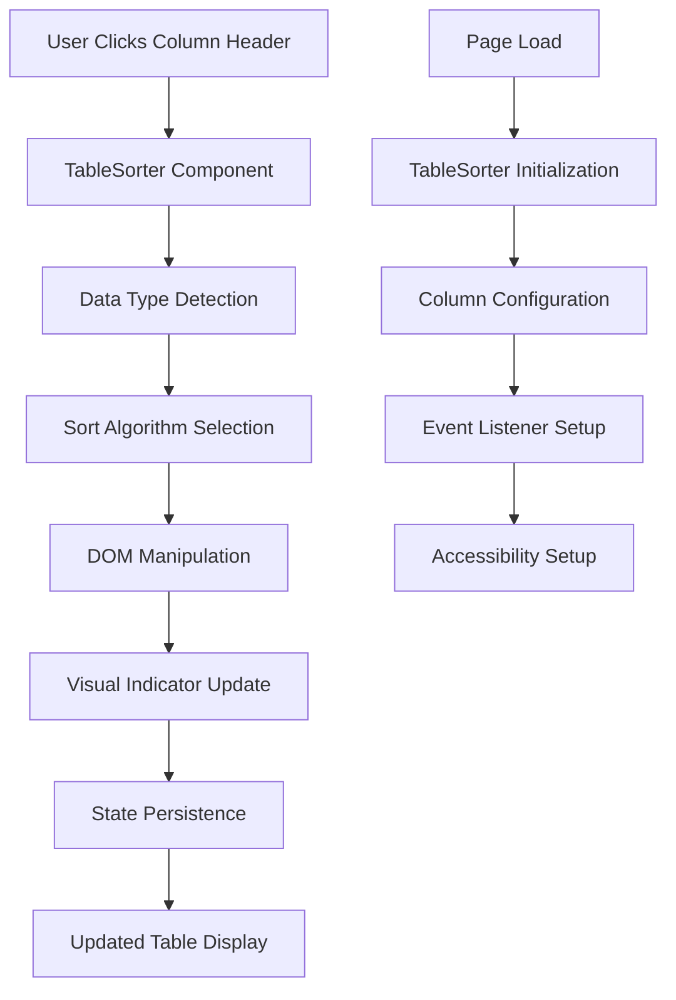

# Design Document: Table Sorting Functionality

## Overview

This design document outlines the implementation of table sorting functionality for the Pet Clinic application. The solution will add client-side sorting capabilities to all four main data tables (Visits, Owners, Pets, and Veterinarians) using JavaScript and CSS enhancements. The implementation will leverage the existing Bootstrap 5.3.2 and jQuery 3.7.1 dependencies while maintaining the current Thymeleaf-based server-side rendering architecture.

The sorting functionality will be implemented as a reusable JavaScript component that can be applied to any table in the application, with support for different data types, visual indicators, and accessibility features.

## Architecture

### High-Level Architecture



### Component Architecture

The table sorting functionality will be implemented using a modular architecture:

1. **TableSorter Core**: Main sorting engine and state management
2. **DataTypeHandlers**: Specialized sorting logic for different data types
3. **VisualIndicators**: UI feedback and sort direction indicators
4. **StateManager**: Persistence and session management
5. **AccessibilityManager**: Keyboard navigation and screen reader support

## Components and Interfaces

### TableSorter Class

The main component responsible for coordinating all sorting functionality:

```javascript
class TableSorter {
    constructor(tableElement, options = {}) {
        this.table = tableElement;
        this.options = this.mergeOptions(options);
        this.currentSort = { column: null, direction: null };
        this.dataTypeHandlers = new Map();
        this.stateManager = new StateManager(this.table.id);
        this.accessibilityManager = new AccessibilityManager(this.table);
        
        this.init();
    }
    
    // Core methods
    init()
    sortByColumn(columnIndex, direction)
    detectDataType(columnIndex)
    applySortToDOM(sortedData, columnIndex, direction)
    updateVisualIndicators(columnIndex, direction)
    persistSortState(columnIndex, direction)
    restoreSortState()
}
```

### DataTypeHandler Interface

Specialized handlers for different data types:

```javascript
class DataTypeHandler {
    constructor(name) {
        this.name = name;
    }
    
    // Abstract methods to be implemented by subclasses
    detect(cellValue) { throw new Error('Must implement detect method'); }
    compare(a, b) { throw new Error('Must implement compare method'); }
    preprocess(value) { return value; }
}

// Concrete implementations
class TextHandler extends DataTypeHandler
class NumericHandler extends DataTypeHandler  
class DateTimeHandler extends DataTypeHandler
class StatusHandler extends DataTypeHandler
```

### VisualIndicator Component

Manages sort direction indicators and visual feedback:

```javascript
class VisualIndicator {
    constructor(headerElement) {
        this.header = headerElement;
        this.indicator = null;
    }
    
    show(direction)
    hide()
    toggle(direction)
    updateAriaLabel(direction)
}
```

### StateManager Component

Handles persistence of sort state across page loads:

```javascript
class StateManager {
    constructor(tableId) {
        this.tableId = tableId;
        this.storageKey = `tableSortState_${tableId}`;
    }
    
    save(columnIndex, direction)
    load()
    clear()
    isSupported()
}
```

### AccessibilityManager Component

Ensures keyboard navigation and screen reader compatibility:

```javascript
class AccessibilityManager {
    constructor(table) {
        this.table = table;
    }
    
    setupKeyboardNavigation()
    updateAriaAttributes(columnIndex, direction)
    announceSort(columnName, direction)
    setupFocusManagement()
}
```

## Data Models

### Sort Configuration

```javascript
const SortConfig = {
    column: Number,           // Column index (0-based)
    direction: String,        // 'asc' | 'desc' | null
    dataType: String,         // 'text' | 'number' | 'date' | 'status'
    timestamp: Date           // When sort was applied
};
```

### Column Metadata

```javascript
const ColumnMetadata = {
    index: Number,            // Column position
    name: String,             // Column header text
    dataType: String,         // Detected or configured data type
    sortable: Boolean,        // Whether column can be sorted
    customComparator: Function, // Optional custom sort function
    formatter: Function       // Optional display formatter
};
```

### Table Configuration

```javascript
const TableConfig = {
    tableId: String,          // Unique table identifier
    sortable: Boolean,        // Global sortable flag
    multiSort: Boolean,       // Support multiple column sorting
    persistState: Boolean,    // Save sort state to localStorage
    defaultSort: SortConfig,  // Initial sort configuration
    columns: Array<ColumnMetadata>, // Column-specific settings
    cssClasses: Object,       // Custom CSS class names
    icons: Object            // Custom sort indicator icons
};
```

## Data Type Detection and Sorting

### Text Sorting
- Case-insensitive alphabetical ordering
- Handles special characters and accented letters
- Empty values sorted to end of list

### Numeric Sorting
- Parses currency symbols and thousands separators
- Handles decimal numbers and percentages
- Treats non-numeric values as zero or sorts to end

### Date/Time Sorting
- Supports multiple date formats (ISO, US, European)
- Handles relative dates ("Today", "Yesterday")
- Chronological ordering with timezone awareness

### Status/Enum Sorting
- Custom ordering for status values (e.g., "Pending" before "Completed")
- Configurable priority ordering
- Handles boolean-like values (Yes/No, Active/Inactive)

## CSS Classes and Styling

### Sort Indicator Styles

```css
.sortable-header {
    cursor: pointer;
    user-select: none;
    position: relative;
    padding-right: 20px;
}

.sort-indicator {
    position: absolute;
    right: 5px;
    top: 50%;
    transform: translateY(-50%);
    opacity: 0.6;
    transition: opacity 0.2s ease;
}

.sort-indicator.active {
    opacity: 1;
}

.sort-asc::after {
    content: "▲";
    font-size: 0.8em;
}

.sort-desc::after {
    content: "▼";
    font-size: 0.8em;
}

.sortable-header:hover .sort-indicator {
    opacity: 0.8;
}

.sortable-header:focus {
    outline: 2px solid #667eea;
    outline-offset: 2px;
}
```

### Table Enhancement Styles

```css
.table-sortable {
    position: relative;
}

.table-sortable thead th.sortable {
    background-color: #f8f9fa;
    border-bottom: 2px solid #dee2e6;
}

.table-sortable thead th.sorted {
    background-color: #e9ecef;
}

.sorting-indicator {
    display: inline-block;
    margin-left: 8px;
    font-size: 0.75em;
    color: #6c757d;
}

.sorting-indicator.asc {
    color: #28a745;
}

.sorting-indicator.desc {
    color: #dc3545;
}
```

## JavaScript Implementation Structure

### Core TableSorter Implementation

```javascript
// Main sorting functionality
class TableSorter {
    constructor(tableElement, options = {}) {
        // Initialize component with configuration
        this.table = tableElement;
        this.tbody = tableElement.querySelector('tbody');
        this.headers = Array.from(tableElement.querySelectorAll('thead th'));
        this.rows = Array.from(this.tbody.querySelectorAll('tr'));
        
        // Configuration and state
        this.options = this.mergeDefaultOptions(options);
        this.currentSort = { column: null, direction: null };
        this.columnMetadata = this.analyzeColumns();
        
        // Initialize components
        this.initializeDataTypeHandlers();
        this.setupEventListeners();
        this.setupAccessibility();
        this.restoreState();
    }
    
    // Column analysis and data type detection
    analyzeColumns() {
        return this.headers.map((header, index) => {
            const sampleData = this.getSampleDataForColumn(index);
            const dataType = this.detectDataType(sampleData);
            
            return {
                index,
                name: header.textContent.trim(),
                dataType,
                sortable: !header.classList.contains('no-sort'),
                element: header
            };
        });
    }
    
    // Main sorting method
    sortByColumn(columnIndex, direction = null) {
        const column = this.columnMetadata[columnIndex];
        if (!column || !column.sortable) return;
        
        // Determine sort direction
        if (direction === null) {
            direction = this.getNextSortDirection(columnIndex);
        }
        
        // Extract and sort data
        const rowData = this.extractRowData(columnIndex);
        const sortedData = this.applySortAlgorithm(rowData, column.dataType, direction);
        
        // Update DOM and UI
        this.reorderTableRows(sortedData);
        this.updateSortIndicators(columnIndex, direction);
        this.updateCurrentSort(columnIndex, direction);
        this.persistState();
        
        // Accessibility announcement
        this.announceSort(column.name, direction);
    }
}
```

### Data Type Handlers

```javascript
// Base handler class
class DataTypeHandler {
    constructor(name) {
        this.name = name;
    }
    
    detect(values) {
        // Override in subclasses
        return false;
    }
    
    compare(a, b, direction = 'asc') {
        const result = this.compareValues(a, b);
        return direction === 'desc' ? -result : result;
    }
    
    compareValues(a, b) {
        // Override in subclasses
        return 0;
    }
    
    preprocess(value) {
        return value;
    }
}

// Text handler
class TextDataTypeHandler extends DataTypeHandler {
    constructor() {
        super('text');
    }
    
    detect(values) {
        return true; // Default fallback
    }
    
    compareValues(a, b) {
        const aStr = String(a || '').toLowerCase();
        const bStr = String(b || '').toLowerCase();
        return aStr.localeCompare(bStr);
    }
}

// Numeric handler
class NumericDataTypeHandler extends DataTypeHandler {
    constructor() {
        super('number');
    }
    
    detect(values) {
        const numericValues = values.filter(v => this.isNumeric(v));
        return numericValues.length / values.length > 0.7; // 70% threshold
    }
    
    isNumeric(value) {
        const cleaned = String(value).replace(/[$,\s%]/g, '');
        return !isNaN(cleaned) && !isNaN(parseFloat(cleaned));
    }
    
    preprocess(value) {
        return parseFloat(String(value).replace(/[$,\s%]/g, '')) || 0;
    }
    
    compareValues(a, b) {
        const numA = this.preprocess(a);
        const numB = this.preprocess(b);
        return numA - numB;
    }
}

// DateTime handler
class DateTimeDataTypeHandler extends DataTypeHandler {
    constructor() {
        super('datetime');
    }
    
    detect(values) {
        const dateValues = values.filter(v => this.isDate(v));
        return dateValues.length / values.length > 0.7;
    }
    
    isDate(value) {
        const date = new Date(value);
        return !isNaN(date.getTime());
    }
    
    preprocess(value) {
        return new Date(value);
    }
    
    compareValues(a, b) {
        const dateA = this.preprocess(a);
        const dateB = this.preprocess(b);
        return dateA.getTime() - dateB.getTime();
    }
}
```

## Integration with Existing Templates

### Template Modifications

The existing Thymeleaf templates will be enhanced with sorting capabilities by adding CSS classes and data attributes:

```html
<!-- Enhanced table structure -->
<table class="table table-hover table-sortable" id="visitsTable">
    <thead class="table-light">
        <tr>
            <th class="sortable" data-sort-type="datetime">Date & Time</th>
            <th class="sortable" data-sort-type="text">Pet</th>
            <th class="sortable" data-sort-type="text">Description</th>
            <th class="sortable" data-sort-type="text">Veterinarian</th>
            <th class="sortable" data-sort-type="status">Status</th>
            <th class="sortable" data-sort-type="number">Cost</th>
            <th class="no-sort">Actions</th>
        </tr>
    </thead>
    <tbody>
        <!-- Existing table rows remain unchanged -->
    </tbody>
</table>
```

### JavaScript Initialization

```javascript
// Auto-initialize sorting on all tables
document.addEventListener('DOMContentLoaded', function() {
    // Initialize sorting for all sortable tables
    const sortableTables = document.querySelectorAll('.table-sortable');
    
    sortableTables.forEach(table => {
        new TableSorter(table, {
            persistState: true,
            showIndicators: true,
            multiSort: false
        });
    });
});
```

## Error Handling

### Graceful Degradation

The sorting functionality will degrade gracefully when:
- JavaScript is disabled (tables remain functional without sorting)
- localStorage is not available (sorting works but state is not persisted)
- Invalid data is encountered (falls back to text sorting)

### Error Recovery

```javascript
class ErrorHandler {
    static handleSortError(error, table, columnIndex) {
        console.warn('Sort error:', error);
        
        // Reset to default state
        const sorter = table.tableSorter;
        if (sorter) {
            sorter.clearSort();
            sorter.showErrorMessage('Sorting temporarily unavailable');
        }
    }
    
    static validateTableStructure(table) {
        const requiredElements = ['thead', 'tbody'];
        return requiredElements.every(selector => 
            table.querySelector(selector) !== null
        );
    }
}
```

## Testing Strategy

### Unit Testing Approach

The testing strategy will use a dual approach combining unit tests and property-based tests:

**Unit Tests**: Focus on specific examples, edge cases, and integration points
- Test individual data type handlers with known inputs
- Verify DOM manipulation correctness
- Test accessibility features
- Validate error handling scenarios

**Property-Based Tests**: Verify universal properties across all inputs
- Sort stability and correctness across random datasets
- Data type detection accuracy
- State persistence reliability
- Performance characteristics

### Property-Based Testing Configuration

Using QuickCheck for Java (already available in the backend dependencies), we'll implement property tests that:
- Generate random table data and verify sort correctness
- Test with minimum 100 iterations per property
- Tag each test with feature and property references
- Validate sorting invariants hold across all data types

### Testing Framework Setup

The implementation will use:
- **JUnit 5** for unit testing framework
- **QuickCheck** for property-based testing
- **Selenium WebDriver** for integration testing (already configured)
- **TestContainers** for isolated testing environments

Each property-based test will be tagged with comments referencing the design document properties for traceability.

## Correctness Properties

*A property is a characteristic or behavior that should hold true across all valid executions of a system—essentially, a formal statement about what the system should do. Properties serve as the bridge between human-readable specifications and machine-verifiable correctness guarantees.*

Based on the requirements analysis, the following correctness properties define the expected behavior of the table sorting functionality:

### Property 1: Column Click Sorting Behavior
*For any* sortable table column, clicking the column header should cycle through sort states: first click sorts ascending, second click sorts descending, third click returns to ascending order.
**Validates: Requirements 1.1, 1.2, 1.3**

### Property 2: Column Switch Behavior  
*For any* table with multiple sortable columns, clicking a different column header should sort by the new column in ascending order and clear any previous sort indicators.
**Validates: Requirements 1.4**

### Property 3: Visual Sort Indicators
*For any* sorted table column, the appropriate visual indicator (ascending/descending arrow) should be displayed next to the column header, and no indicators should be shown when no column is sorted.
**Validates: Requirements 2.1, 2.2, 2.3, 2.4**

### Property 4: Text Data Sorting
*For any* column containing text data, sorting should use case-insensitive alphabetical ordering with empty values placed at the end of the sorted list.
**Validates: Requirements 3.1, 3.4**

### Property 5: Numeric Data Sorting
*For any* column containing numeric data (including currency and percentages), sorting should use numerical ordering rather than lexicographic ordering, with empty values placed at the end.
**Validates: Requirements 3.2, 3.4**

### Property 6: Date/Time Data Sorting
*For any* column containing date/time data, sorting should use chronological ordering with empty values placed at the end of the sorted list.
**Validates: Requirements 3.3, 3.4**

### Property 7: Status Data Sorting
*For any* column containing status or boolean data, sorting should group similar values together in a logical order (e.g., Pending before Completed).
**Validates: Requirements 3.5**

### Property 8: Sort State Persistence
*For any* table with sorting applied, the sort configuration should persist across page refreshes and navigation, maintaining both the sorted column and direction.
**Validates: Requirements 8.1, 8.2**

### Property 9: Filter Interaction Preservation
*For any* sorted table, applying or removing filters should maintain the current sort order on the resulting dataset.
**Validates: Requirements 8.3, 8.4**

### Property 10: Performance Requirements
*For any* table with up to 1000 rows, sorting operations should complete within 500 milliseconds while providing visual feedback during processing.
**Validates: Requirements 9.1, 9.2**

### Property 11: UI Responsiveness
*For any* sort operation, the user interface should remain responsive and not block user interactions during the sorting process.
**Validates: Requirements 9.4**

### Property 12: Keyboard Accessibility
*For any* sortable column header, users should be able to activate sorting using Enter or Space keys, with appropriate focus indicators and ARIA attributes.
**Validates: Requirements 10.1, 10.3, 10.4**

### Property 13: Screen Reader Accessibility
*For any* sort operation, appropriate announcements should be made to screen readers indicating the column name and sort direction.
**Validates: Requirements 10.2**

### Property 14: Visual Feedback on Hover
*For any* sortable column header, hovering should provide visual feedback indicating the column is sortable.
**Validates: Requirements 10.5**