# Pet Clinic Management System - Project Flowchart

## Document Information

- **Document Version**: 2.0
- **Last Updated**: January 30, 2026
- **Status**: Current
- **Purpose**: Visual representation of system workflows and processes

## System Architecture Flowchart

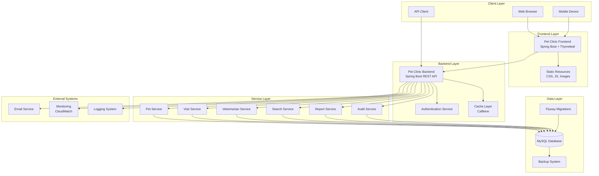

## User Journey Flowcharts

### 1. Pet Registration Workflow

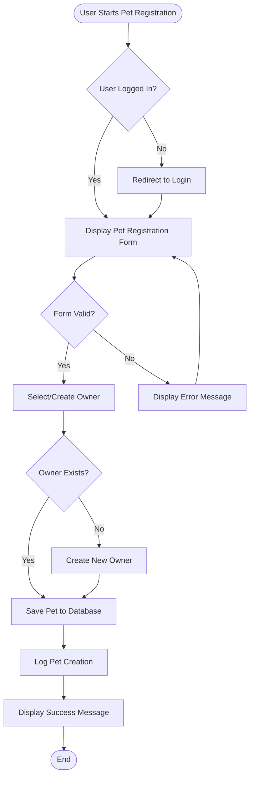

### 2. Visit Scheduling Workflow

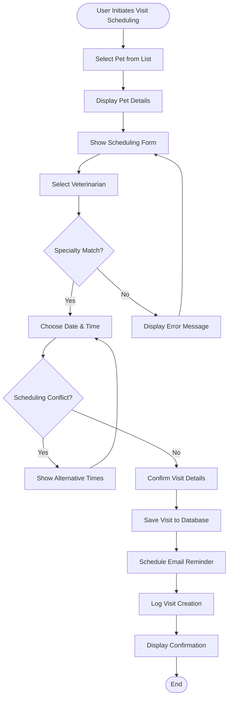

### 3. Search and Filter Workflow

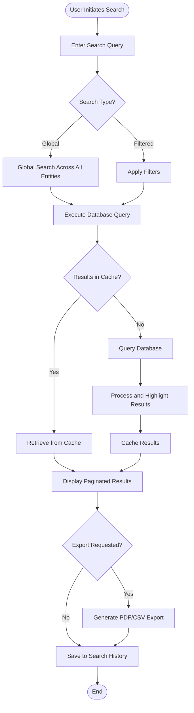

## Data Flow Diagrams

### 1. Pet Management Data Flow

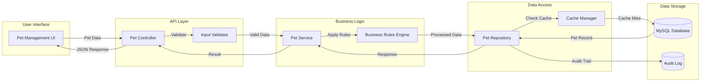

### 2. Authentication and Authorization Flow

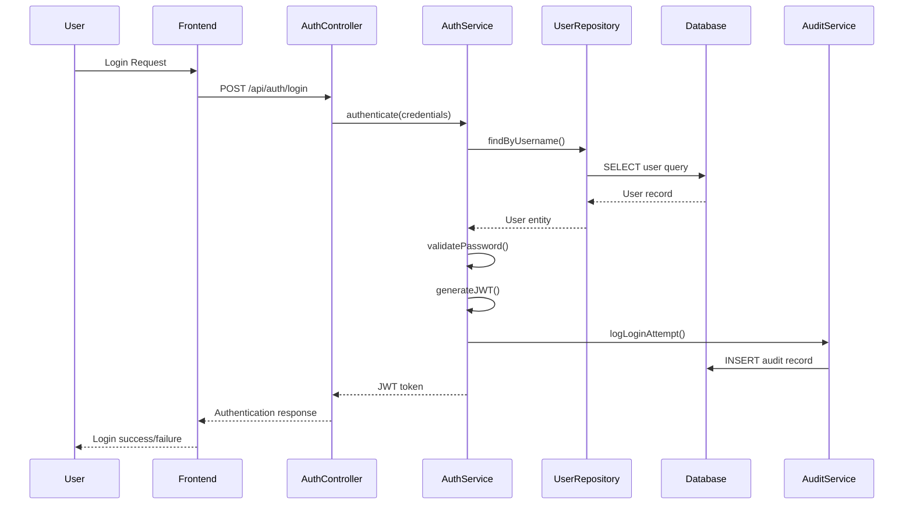

### 3. Visit Scheduling Process Flow

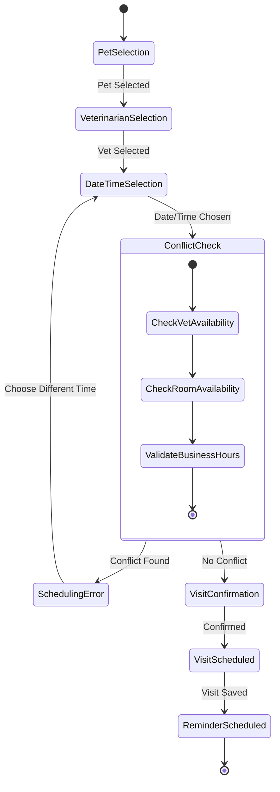

## System Integration Flowchart

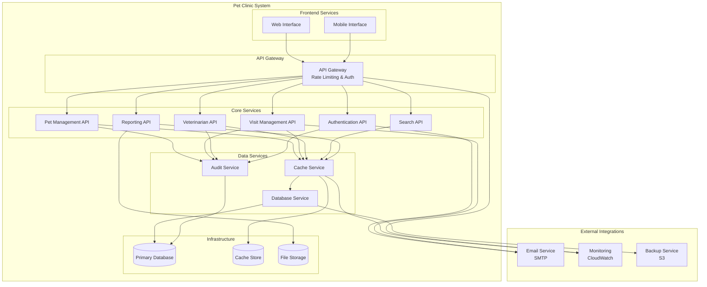

## Security Flow Diagram

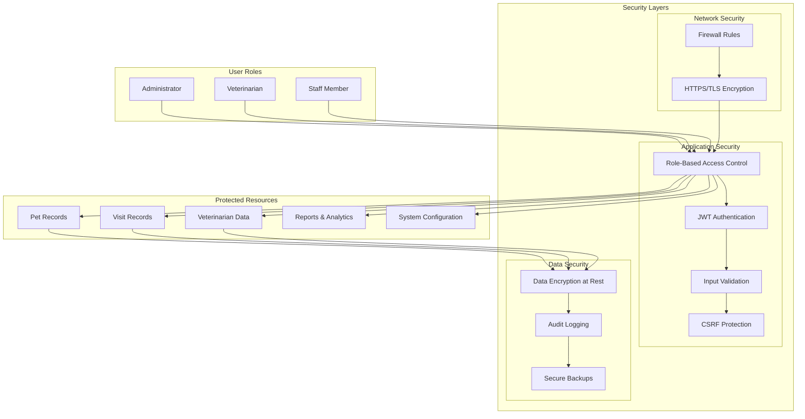

## Performance Optimization Flow

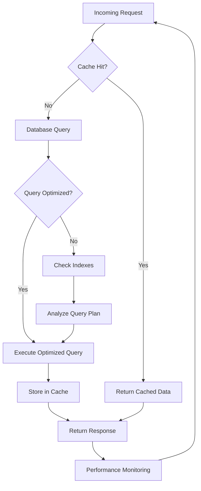

## Error Handling and Recovery Flow

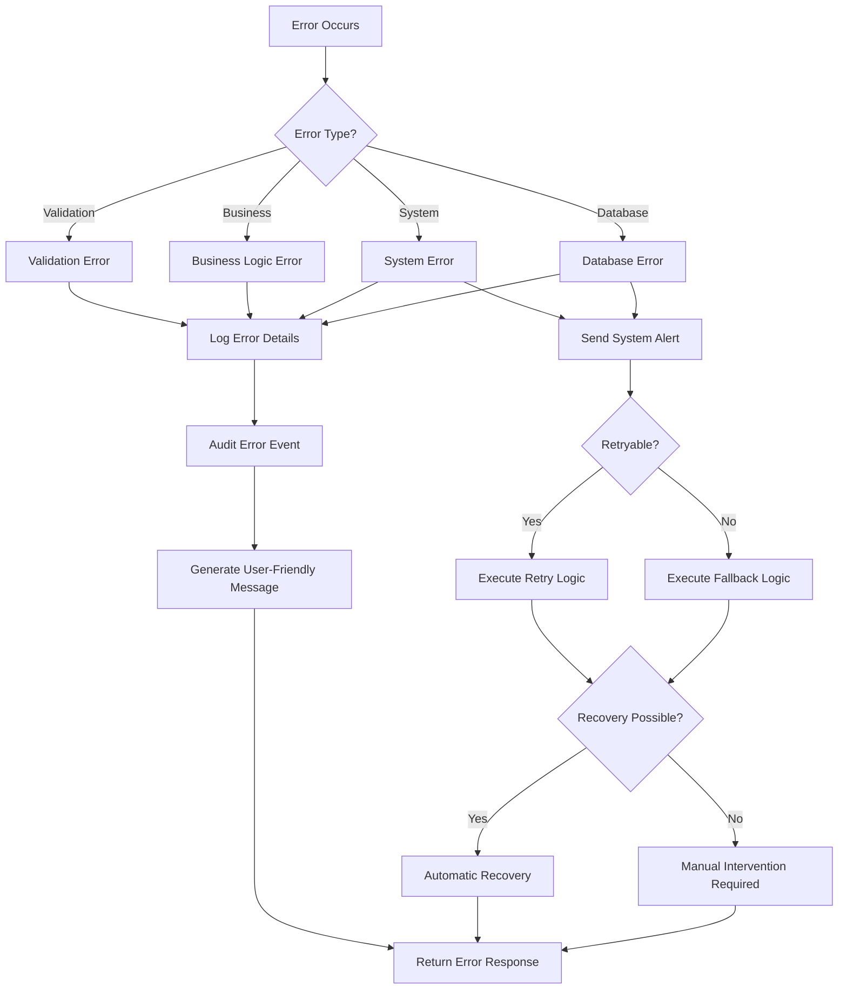

## Deployment and CI/CD Flow

```mermaid
flowchart LR
    subgraph "Development"
        DEV[Developer]
        GIT[Git Repository]
        PR[Pull Request]
    end

    subgraph "CI/CD Pipeline"
        BUILD[Build & Test]
        QUALITY[Quality Gates]
        SECURITY[Security Scan]
        PACKAGE[Package Application]
    end

    subgraph "Deployment Environments"
        DEV_ENV[Development]
        STAGING[Staging]
        PROD[Production]
    end

    subgraph "Monitoring"
        HEALTH[Health Checks]
        METRICS[Performance Metrics]
        ALERTS[Alerting System]
    end

    DEV --> GIT
    GIT --> PR
    PR --> BUILD
    BUILD --> QUALITY
    QUALITY --> SECURITY
    SECURITY --> PACKAGE
    
    PACKAGE --> DEV_ENV
    DEV_ENV --> STAGING
    STAGING --> PROD
    
    DEV_ENV --> HEALTH
    STAGING --> HEALTH
    PROD --> HEALTH
    
    HEALTH --> METRICS
    METRICS --> ALERTS
```

## Database Schema Relationships

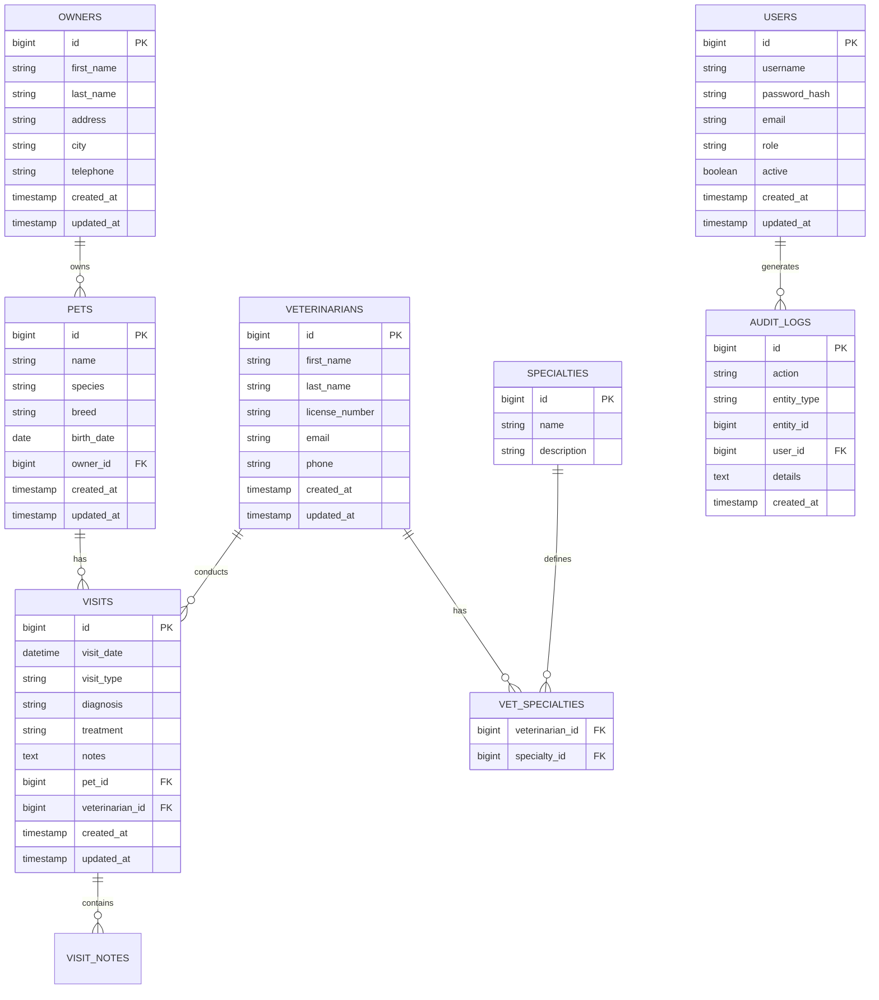

## Conclusion

This flowchart documentation provides comprehensive visual representations of the Pet Clinic Management System's workflows, processes, and architecture. These diagrams serve as:

1. **System Understanding**: Clear visualization of how components interact
2. **Development Guide**: Reference for developers implementing features
3. **Troubleshooting Aid**: Visual guide for diagnosing issues
4. **Documentation**: Comprehensive system documentation
5. **Training Material**: Visual aids for user and developer training

The flowcharts are designed to be:
- **Comprehensive**: Covering all major system processes
- **Clear**: Easy to understand and follow
- **Maintainable**: Can be updated as the system evolves
- **Practical**: Useful for both technical and non-technical stakeholders

---

**Document Maintained By**: Development Team  
**Review Cycle**: Updated with major system changes  
**Format**: Mermaid diagrams for version control compatibility